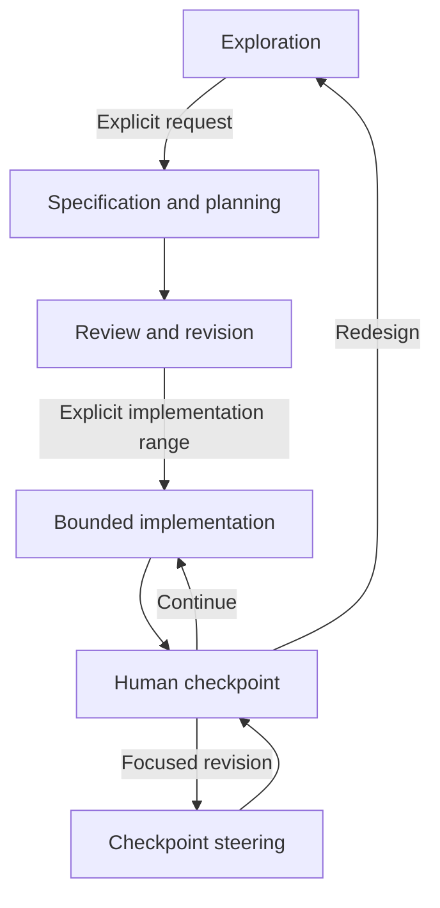
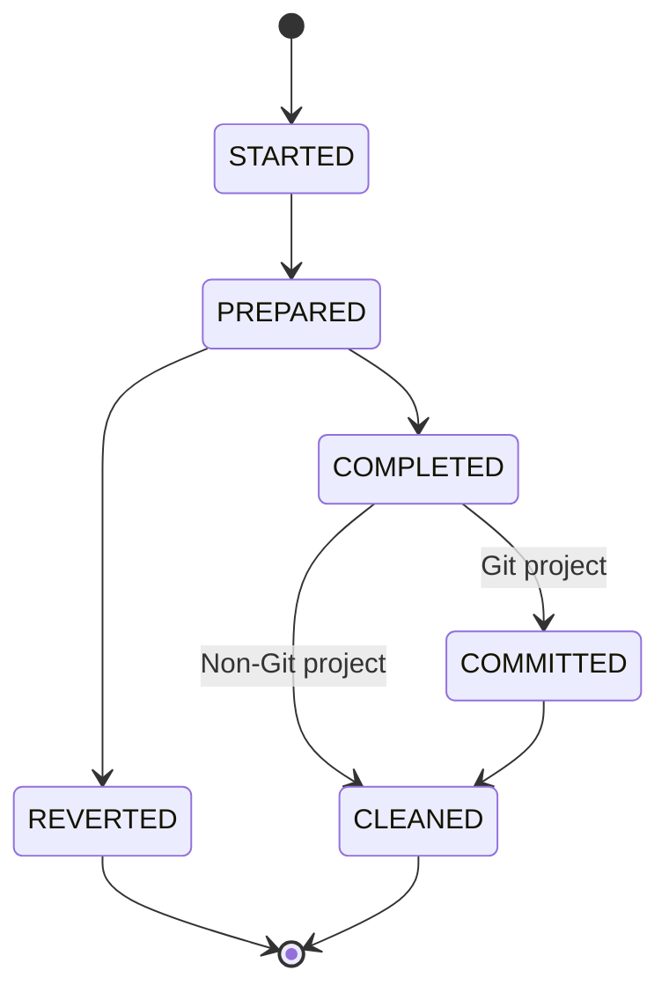

# SDD Manager

**SDD Manager (`sdd-man`) is an implementation of specification-driven development for AI-assisted software projects.** It gives a coding agent a coherent operating model from early problem exploration through specification, planning, bounded implementation, verification, interruption recovery, and human steering.

The project treats specifications and plans as durable engineering authorities rather than disposable prompts. It is designed for work that may span many conversations, cross several implementation phases, encounter failed tests or interruptions, and require the developer to revise completed behavior before allowing the agent to continue.

SDD Manager is available as an installed skill for ChatGPT and Codex. Invoke it explicitly with `$sdd-man`, or describe a task that falls within its specification-driven development workflows.

> [!NOTE]
> This README is a human-facing companion to the skill. The installed `SKILL.md` and its focused workflow references define agent behavior. Project-specific instructions and project authorities remain authoritative for each target project.

## Contents

- [Why this project exists](#why-this-project-exists)
- [Relationship to other SDD projects](#relationship-to-other-sdd-projects)
- [Core principles](#core-principles)
- [Capabilities](#capabilities)
- [What SDD Manager does not do](#what-sdd-manager-does-not-do)
- [Lifecycle](#lifecycle)
- [Quick start](#quick-start)
- [Authoritative project documents](#authoritative-project-documents)
- [Authority and precedence](#authority-and-precedence)
- [Exploration and document authoring](#exploration-and-document-authoring)
- [Roadmap and bounded work](#roadmap-and-bounded-work)
- [Implementation transactions](#implementation-transactions)
- [Git and non-Git projects](#git-and-non-git-projects)
- [Verification strategy](#verification-strategy)
- [Recovery and resumption](#recovery-and-resumption)
- [Human-in-the-loop checkpoints](#human-in-the-loop-checkpoints)
- [Focused steering and normalization](#focused-steering-and-normalization)
- [Completion reporting](#completion-reporting)
- [Example end-to-end journeys](#example-end-to-end-journeys)
- [Prompt cookbook](#prompt-cookbook)
- [Project integration](#project-integration)
- [Skill architecture](#skill-architecture)
- [Portability and safety](#portability-and-safety)
- [Troubleshooting](#troubleshooting)
- [Validation status](#validation-status)
- [Maintenance principles](#maintenance-principles)
- [Terminology](#terminology)
- [FAQ](#faq)

## Why this project exists

AI coding agents can produce useful software quickly, but long-running development exposes failure modes that are not solved by code generation alone:

- requirements drift while implementation is underway;
- a specification, plan, codebase, tests, and progress report gradually describe different systems;
- an agent continues beyond the task or phase the developer intended to review;
- an interruption leaves partially modified files with no reliable way to determine what is safe to keep;
- test selection has to be rediscovered from imports and naming conventions on every run;
- feature revisions leave obsolete code, tests, dependencies, examples, or planning material behind;
- progress reports describe files and commands without explaining what usable capability was delivered;
- successive feature work accumulates migration documents instead of maintaining one intelligible description of the current system.

SDD Manager addresses those operational problems, but its motivation is broader.

### A tool tailored to a developer's workflow

The project is intended to encode a development style in which the developer remains the authority over transitions and stopping boundaries. The agent may explore, specify, plan, implement, recover, or revise, but it must not silently move from one mode into another.

The workflow is deliberately compatible with requests such as:

- implement exactly the next task;
- implement the next three tasks;
- complete the current milestone and stop;
- resume an interrupted task;
- explain current project status without changing anything;
- revise one capability at the checkpoint before proceeding;
- remove a previously implemented behavior and make the current documents read as if it had never been part of the intended design.

### A learning-by-doing experiment

SDD Manager is also an experiment in developing an advanced engineering workflow with a state-of-the-art AI agent. The project was not limited to drafting prompts. Its own development used a complete specification, phased plan, traceability audit, independent forward tests, recovery fixtures, checkpoint steering, and final acceptance.

That process tests a stronger proposition than “an agent can write code”: an agent can participate in a disciplined, inspectable development system whose documents, state transitions, verification, and reports remain coherent over time.

### Exploration as part of development

Many specification workflows begin once requirements are already known. SDD Manager includes the preceding exploratory conversation as an explicit mode. Exploration develops outcomes, constraints, alternatives, terminology, assumptions, and open questions without prematurely creating authoritative documents or changing code.

The developer decides when the explored design is mature enough to become a specification.

### Recovery, resumption, and midstream steering

Implementation is not assumed to complete in one uninterrupted session. Every implementation task is a recoverable transaction with a declared path set, a prepared baseline, recorded verification, and a durable terminal state.

The same model supports human steering between task, milestone, or phase ranges. The developer can accept the work, continue through another bounded range, revise future work, or request a focused revision of behavior that has already been implemented.

### Integral current-state documents

Temporary feature specifications and plans are useful while a change is active, but they should not become the only way to understand the system. After a feature or steering revision is accepted, SDD Manager normalizes the result into the main SPEC, PLAN, LAYOUT, ROADMAP, verification map, and user documentation.

The main documents continue to describe the complete current system and how to build it from scratch. Historical execution remains in the journal and, where applicable, project history—not in an ever-growing stack of migration narratives.

## Relationship to other SDD projects

SDD Manager exists in a growing ecosystem of specification-driven and agent-oriented development systems. Two well-known projects are especially relevant.

### GitHub Spec Kit

[GitHub Spec Kit](https://github.com/github/spec-kit) is an open-source toolkit that supplies AI coding agents with structured processes, reusable templates, and documented outcomes. Its current core SDD process carries a feature through a project constitution, specification, technical plan, tasks, implementation, and convergence. The project also provides independent processes for bug fixing and idea assessment, supports existing projects, and offers extensions, presets, workflows, and bundles.

Spec Kit is therefore broader today than a simple `specify → plan → implement` prompt chain. It is an established toolkit for installing and customizing structured agent processes.

### Superpowers

[Superpowers](https://github.com/obra/superpowers) describes itself as a complete software-development methodology built from composable agent skills. Its current basic workflow includes brainstorming, isolated worktrees, detailed implementation plans, subagent-driven or inline execution, test-driven development, code review, and branch completion. It supports a wide range of coding-agent harnesses and emphasizes automatic skill activation and mandatory engineering practices.

### Positioning of SDD Manager

SDD Manager is not presented as a fork, replacement, or benchmark winner over either project. The author has not been following their recent evolution closely enough to make a comprehensive experiential comparison. The descriptions above were checked against their current primary documentation in September 2026 and are included to place this project in its proper context.

The distinctive emphasis of SDD Manager is the integration of:

- exploration before specification;
- complete-current-state SPEC, PLAN, and LAYOUT authorities;
- a PLAN-derived human-readable ROADMAP;
- explicit component-to-test verification mapping;
- bounded implementation selected by task, milestone, phase, or campaign;
- recoverable task transactions for both Git and non-Git projects;
- mandatory startup reconciliation and interruption recovery;
- human steering after intermediate ranges;
- normalization after a completed feature is revised or removed;
- capability-oriented task, milestone, phase, and campaign reporting.

These are design priorities, not claims that other systems cannot support similar practices.

## Core principles

### Specification before implementation

Implementation follows accepted requirements and an ordered plan. When implementation reveals a missing public contract or unresolved architectural decision, the workflow returns to exploration or document revision rather than silently inventing behavior in code.

### Explicit lifecycle transitions

Skill activation supplies procedure, not authorization. Exploring an idea does not authorize document creation. Creating documents does not authorize implementation. Completing a task does not authorize the next task.

### Complete-current-state documentation

The primary documents describe the system that should exist now. Temporary change documents express an active delta, then retire after the accepted change is integrated.

### PLAN as the canonical work hierarchy

PLAN owns phases, milestones, tasks, dependencies, paths, verification, and completion conditions. ROADMAP projects that hierarchy as a progress checklist; it does not define a competing plan.

### One recoverable transaction per task

Each PLAN task has its own identity, declared path operations, recoverable baseline, verification, completion record, and cleanup. A multi-task request remains a sequence of independent task transactions.

### Evidence-based progress

A checkbox is not proof. Durable progress is reconciled from PLAN, ROADMAP, journal, recovery state, filesystem state, verification evidence, and project history when available.

### Human-controlled stopping boundaries

After the requested range is complete, the project enters `awaiting-steering`. The agent reports the result and exact next boundary, then stops.

### Capability-oriented reports

Every task, milestone, phase, and campaign report explains the verified capability delivered at that level. File lists, commands, and identifiers are supporting evidence rather than the main result.

### Optional automation only

Scripts may automate a clear, deterministic, repeatedly useful operation. They must not decide product requirements, architecture, document decomposition, ambiguous ownership, or sufficiency of verification. The current skill contains no bundled scripts.

## Capabilities

| Capability | Result |
|---|---|
| Exploratory development | Clarifies problems, constraints, alternatives, and decisions without unauthorized mutation |
| Document generation | Produces coherent SPEC, PLAN, LAYOUT, ROADMAP, and verification-map foundations |
| Document review | Propagates corrections and removes superseded design without beginning implementation |
| Project discovery | Locates project roots, instructions, authorities, tools, and execution state |
| Status inspection | Reports reconciled progress and blockers without modifying the project |
| Bounded implementation | Executes a named or relative task, task count, milestone, phase, MVP, or campaign range |
| Change campaigns | Applies a temporary baseline-plus-delta specification and normalizes the final result |
| Progress tracking | Maintains exact PLAN-to-ROADMAP correspondence and durable checklist semantics |
| Verification routing | Maps components and paths to direct, dependent, integration, quality, and boundary checks |
| Failure handling | Distinguishes task-caused, pre-existing, unrelated, and unavailable verification failures |
| Recovery | Restores or reconciles interrupted transactions before new work begins |
| Git and non-Git operation | Uses the strongest available durability evidence without making Git mandatory |
| Human steering | Revises completed or future work at clean intermediate checkpoints |
| Capability removal | Removes rejected behavior and normalizes current-state authorities |
| Completion reporting | Synthesizes task, milestone, phase, campaign, recovery, and steering outcomes |

## What SDD Manager does not do

SDD Manager does not:

- invent product requirements and call them accepted;
- create authoritative documents merely because exploration appears mature;
- begin implementation merely because a plan exists;
- require Git, a specific language, a particular shell, or a particular test runner;
- replace project-specific `AGENTS.md`, `PROJECT.md`, build configuration, or contributor rules;
- infer that import analysis alone defines adequate verification;
- treat passing tests alone as durable completion;
- overwrite unrelated dirty files or silently absorb them into a task;
- guess which source is correct when authoritative evidence conflicts;
- continue beyond a human checkpoint without explicit authorization;
- preserve rejected features in current-state documents merely to narrate history;
- require a bundled status, roadmap, verification, or recovery script.

## Lifecycle

The ordinary lifecycle is deliberately gated:



Direct entry into a later mode is allowed when the project already has adequate governing artifacts and the developer explicitly requests that mode. Earlier stages are not replayed mechanically.

### Modes

| Mode | Purpose | Mutation policy |
|---|---|---|
| Exploration | Clarify the problem and design space | No project mutation unless explicitly requested |
| Document authoring | Create or materially revise authorities | Documents only; no implementation |
| Review and revision | Correct or restructure authorities | Documents only; no implementation |
| Status inspection | Determine current project state | Read-only |
| Implementation | Execute an authorized bounded range | Recoverable task transactions only |
| Recovery | Resolve nonterminal or inconsistent execution state | Only evidence-backed recovery actions |
| Checkpoint steering | Revise completed or future work | Focused, recoverable revision |
| Reporting | Communicate verified status and capability | No implied continuation |

## Quick start

### Explore a new project

```text
Use $sdd-man to explore a cross-platform tool that validates internal links in a Markdown notes directory. Do not create project files yet.
```

Expected behavior:

- clarify users, inputs, dialects, path semantics, output formats, and scale;
- distinguish accepted decisions from proposals and open questions;
- compare reasonable approaches;
- avoid creating SPEC, PLAN, or implementation until requested.

### Generate the authoritative documents

```text
Use $sdd-man to consolidate the accepted design into SPEC, PLAN, LAYOUT, ROADMAP, and an initial verification map. Do not implement it.
```

Expected behavior:

- inspect an existing codebase when applicable;
- create a complete current-state specification;
- derive an ordered implementation plan;
- mirror its hierarchy exactly in the roadmap;
- describe physical ownership in the layout;
- map only implemented components initially, while placing future verification obligations in PLAN.

### Implement a bounded range

```text
Use $sdd-man to implement the next milestone and stop for review.
```

Expected behavior:

- reconcile startup state before selecting work;
- resolve the exact milestone from PLAN and ROADMAP;
- execute each included task as a separate transaction;
- run task and crossed-boundary verification;
- update durable progress;
- report the integrated milestone capability;
- identify the next task without starting it.

### Resume interrupted work

```text
Use $sdd-man to resume this implementation safely. Resolve any interrupted task before doing new work.
```

Expected behavior:

- inspect journal, recovery data, filesystem, roadmap, and project history;
- classify the interrupted state;
- restore, commit, clean, or escalate according to evidence;
- never layer a new task over unresolved recovery state.

### Revise completed behavior

```text
Use $sdd-man to revise the completed archive milestone so encrypted archives are unsupported. Remove obsolete code and positive tests, normalize the documents, verify the affected boundary, and stop again.
```

Expected behavior:

- suspend forward work;
- inspect the complete impact surface;
- implement the revision through new task transactions;
- retain an explicit rejection test where useful;
- normalize the main authorities;
- preserve execution history;
- return to `awaiting-steering`.

## Authoritative project documents

SDD Manager uses a compact root document set, with focused child documents when project scale justifies decomposition.

### `docs/dev/SPEC.md`

SPEC defines the required current system:

- goals and users;
- observable behavior;
- interfaces and errors;
- invariants and constraints;
- compatibility and non-goals;
- acceptance conditions.

SPEC describes what must be true, not the chronological history of how requirements changed.

### `docs/dev/PLAN.md`

PLAN defines how to construct the complete specified system from scratch:

- phases and their architectural capabilities;
- milestones and useful stopping boundaries;
- tasks and their dependencies;
- anticipated paths and operations;
- verification obligations;
- task, milestone, and phase completion conditions.

### `docs/dev/layout.md`

LAYOUT defines where responsibilities live:

- repository tree;
- production components;
- test organization;
- dependency direction;
- generated and runtime artifacts;
- packaging ownership;
- development-document structure.

### `docs/dev/ROADMAP.md`

ROADMAP is generated from PLAN after the plan structure is settled. It provides:

- one checklist item for every current PLAN phase, milestone, and task;
- exact PLAN order;
- links to canonical PLAN nodes;
- completed and total counts at every hierarchy level;
- a direct human view of the next planned boundary.

ROADMAP is a projection, not a second planning authority.

### `docs/dev/verification-map.json`

The verification map records current component-to-check relationships. A typical conceptual structure includes:

```json
{
  "schema_version": 1,
  "components": [
    {
      "id": "archive-reader",
      "paths": ["src/package/archive.py"],
      "targets": ["archive-unit", "archive-integration"]
    }
  ],
  "targets": {
    "archive-unit": {
      "kind": "unit",
      "command": ["python", "-m", "pytest", "tests/test_archive.py"]
    }
  }
}
```

The exact schema is project-defined. The important contract is that current paths map to explicit checks, shared targets can be deduplicated, and the agent still applies engineering judgment for affected behavior not captured by mechanical mapping.

### `docs/dev/FEATURE-SPEC.md` and `FEATURE-PLAN.md`

These optional files define an active change against the main baseline. Both must exist or neither should exist.

When the change campaign is complete:

1. the accepted behavior is integrated into the main SPEC;
2. the final from-scratch construction is integrated into the main PLAN;
3. LAYOUT, ROADMAP, verification mapping, and user documentation are updated;
4. superseded baseline statements are removed;
5. the temporary feature files are retired.

### Recursive decomposition

Larger documents may delegate focused ownership to child trees such as:

```text
docs/dev/
├── SPEC.md
├── spec/
├── PLAN.md
├── plan/
├── layout.md
├── layout/
├── ROADMAP.md
└── verification-map.json
```

Root documents remain useful orientation nodes. Decomposition follows stable responsibility boundaries rather than arbitrary document size alone.

## Authority and precedence

SDD Manager uses the following responsibility model:

| Source | Responsibility |
|---|---|
| Current explicit user instruction | Authorization, accepted decisions, and steering |
| Project instruction files | Local rules, tools, conventions, and required checks |
| Main SPEC | Complete required current system |
| Active change specification | Explicit intended delta from the baseline |
| Main PLAN | Complete from-scratch implementation blueprint |
| Active change plan | Dependency-ordered work for the active delta |
| LAYOUT | Physical location and ownership |
| ROADMAP | PLAN-derived durable progress view |
| Verification map | Current component-to-check routing |
| Journal and recovery state | Transaction and resumption evidence |
| Project history | Durable task and historical evidence when available |

An active change specification overrides the main SPEC only where it explicitly defines a revision. More deeply scoped project instructions apply to paths inside their scope.

When authorities conflict and no precedence rule resolves the issue, the agent stops before mutation, identifies the exact conflict, preserves evidence, and asks the developer which requirement governs.

## Exploration and document authoring

### Exploration state

Exploration should continuously distinguish:

- facts supplied by the developer or project;
- accepted decisions;
- working assumptions;
- proposals and alternatives;
- open questions;
- rejected alternatives.

The agent may inspect existing material, compare designs, produce pseudocode, or run small explicitly authorized experiments. It must not quietly promote a suggestion into a requirement.

### Specification readiness

The project is ready to move from exploration into specification when the important observable behavior, scope, constraints, and unresolved decisions are sufficiently clear to produce an internally coherent authority.

Readiness does not itself authorize the transition. The developer requests document generation explicitly.

### Document review

A correction after document generation is treated as a change to intended design. The agent propagates it across affected specification, plan, layout, roadmap, and verification nodes, removes superseded statements, and rechecks dependency order and testability.

Document review never implies permission to begin implementation.

## Roadmap and bounded work

### Hierarchy

- **Phase:** a major architectural capability.
- **Milestone:** a meaningful, useful, and reviewable stopping point.
- **Task:** the smallest independently recoverable implementation transaction.

A roadmap might report:

| Level | Completed | Total |
|---|---:|---:|
| Phases | 1 | 3 |
| Milestones | 3 | 8 |
| Tasks | 9 | 21 |

### Checklist semantics

- `[ ]` means the item is not durably complete.
- `[x]` means durable execution evidence supports completion.
- Started, prepared, partial, blocked, and reverted states live in the execution evidence rather than alternate checkbox syntax.
- A checked milestone requires all current child tasks and milestone verification.
- A checked phase requires all current child milestones and phase verification.

### Supported implementation ranges

The developer may authorize:

- one named task;
- the next task;
- the next `N` tasks;
- the current or next milestone;
- the next `N` milestones;
- the current or next phase;
- the next `N` phases;
- a named boundary and its incomplete prerequisites;
- the explicit MVP boundary;
- the remainder of the campaign.

“Next” is resolved from PLAN after ROADMAP, journal, recovery state, filesystem, and project history have been reconciled. A partially completed current milestone is completed before a later milestone is selected.

### Human inspection

The roadmap makes requests such as “complete the next milestone” inspectable before execution. It also gives the developer a stable place to see progress without reconstructing it from a long journal.

The journal remains necessary because a checklist cannot represent transaction state or recovery evidence.

## Implementation transactions

Each PLAN task follows a recoverable state machine:



### Start

Before mutation, the agent:

1. identifies the PLAN task and requested stopping boundary;
2. reads the relevant SPEC, PLAN, LAYOUT, ROADMAP, verification mapping, code, tests, and instructions;
3. enumerates anticipated path operations as `create`, `modify`, `delete`, or `rename`;
4. identifies required checks;
5. records current repository and filesystem state;
6. refuses to claim dirty target paths whose ownership is not established;
7. appends a `started` event.

### Prepare

Preparation creates exact task-local recovery material:

```text
.implementation-state/<task-id>/
├── manifest.json
└── backup/
```

The manifest records the declared operations and enough content, type, mode, hash, absence, and rename information to restore the complete task baseline. A `prepared` event is written only after this material is verified.

### Implement and verify

The agent modifies only declared task paths. If legitimate work expands beyond the prepared scope, it uses an explicit scope-extension protocol before touching added paths.

Verification proceeds from narrow to broad and includes every applicable PLAN or boundary obligation.

### Complete durably

A `completed` journal event records:

- the implemented capability;
- important supported and unsupported boundaries;
- verification commands and outcomes;
- resulting progress;
- milestone or phase synthesis when the task closes a higher boundary.

In a Git project, durable task completion normally requires a task commit with the exact task identity. In a non-Git project, durability depends on verified final-state evidence recorded in the journal.

Recovery data is removed only after the terminal result is verified.

## Git and non-Git projects

Git strengthens durability and inspection but is not required.

| Concern | Git-backed project | Non-Git project |
|---|---|---|
| Baseline evidence | History plus recovery manifest | Recovery manifest and exact backups |
| Task completion | Exact task commit plus journal record | Verified final-state inventory plus journal record |
| Checkpoint durability | Narrow metadata commit when required | Durable checkpoint record |
| Interrupted completion | Diff, commit, and recovery reconciliation | Hash, filesystem, and recovery reconciliation |
| Unrelated changes | Preserved and excluded from staging | Preserved through scoped ownership |
| Next-work gate | Clean task state and reconciled evidence | Clean task state and reconciled evidence |

The agent discovers whether Git is present. It does not initialize Git merely to satisfy the protocol unless the developer explicitly requests that change.

## Verification strategy

### Why a registry is useful

Imports are useful evidence, but they do not express every behavior dependency. A changed parser may affect a public CLI without importing it directly; several components may share one integration suite; a PLAN may require packaging or installed-workflow checks that code analysis cannot infer.

The verification map makes current relationships explicit and reusable.

### Selection order

For a changed component, the agent selects:

1. direct component tests;
2. tests for affected dependents;
3. shared integration targets, deduplicated;
4. quality, lint, type, build, or packaging checks required by the project;
5. checks explicitly required by the active PLAN task;
6. milestone, phase, or campaign acceptance crossed by the task.

The map narrows deterministic lookup. Engineering judgment still determines whether additional behavior is affected.

### Maintaining the map

When tests are created, the task should update the verification map while the component, test purpose, and dependencies are fresh. Later agents can then select appropriate checks without reconstructing the entire test topology.

Mappings should be removed or changed when components move, tests are retired, or checkpoint steering eliminates a capability.

### Failure classification

Failures are classified before repair:

- **Task-caused:** introduced by the active task and fixed inside its transaction when within scope.
- **Pre-existing:** already present at the established baseline.
- **Unrelated:** outside the active task's behavior or owned paths.
- **Unavailable:** a required check cannot run in the current environment.
- **Specification-related:** exposes a missing or contradictory required contract.

Tests are not weakened, valid assertions are not removed, and unrelated behavior is not changed merely to obtain a passing run.

## Recovery and resumption

Recovery is a mandatory startup gate for every implementation invocation, not merely an error handler used after a visible crash.

### Startup inspection

The agent inspects:

- governing project instructions;
- current document set and active campaign;
- journal records;
- recovery directories and manifests;
- ROADMAP state;
- relevant filesystem state;
- matching task commits when Git exists;
- current verification routing.

### Principal recovery states

| Evidence | Classification | Normal action |
|---|---|---|
| No nonterminal transaction or unexplained recovery data | Clean | Permit bounded task selection |
| `started` without valid preparation and no mutation | Started not prepared | Remove incomplete preparation, record reversion, restart with a new ID |
| `prepared` without completion | Prepared incomplete | Restore the full baseline, verify, record reversion, restart |
| `completed` without required task commit | Completed uncommitted | Validate exact state and checks, then commit or restore and restart |
| Exact task commit with recovery data remaining | Committed not cleaned | Validate attribution and remove only matching recovery data |
| Non-Git completion with recovery data remaining | Completed not cleaned | Reconcile final-state hashes and checks, then clean |
| Conflicting or unattributable evidence | Inconsistent or ambiguous | Preserve evidence and ask for direction |

### Restoration invariant

Restoration is all-or-nothing for the declared task path set. The agent does not restore a convenient subset and continue as though the original transaction remained valid.

After exact restoration, the task is `reverted`; no implementation completion is claimed. A retry receives a new task identifier.

### Evidence preservation

Unexpected recovery data is not deleted because it appears old. Missing or corrupt required evidence, uncertain path ownership, overlapping active tasks, or unexplained mutations cause the agent to stop and request the smallest decision needed to proceed.

## Human-in-the-loop checkpoints

After the requested range is durably complete, the agent establishes a checkpoint:

1. every included task is confirmed complete;
2. task and crossed-boundary verification passes;
3. recovery state is clean;
4. PLAN, ROADMAP, journal, filesystem, verification mapping, and project history agree;
5. the delivered capability is reported;
6. the exact next incomplete boundary is identified;
7. a checkpoint record is made durable;
8. the project enters `awaiting-steering`.

At this boundary, the developer may:

- accept the result and stop;
- authorize another bounded range;
- request a focused revision of completed behavior;
- revise future work only;
- reopen exploration or architectural design;
- abandon the campaign.

Acceptance of the report is not authorization to continue unless it includes an explicit next range.

## Focused steering and normalization

### Classify the revision

Before changing completed work, the agent classifies the request:

| Classification | Meaning |
|---|---|
| Contract-neutral simplification | Internal complexity changes without changing required observable behavior |
| Contract revision | Public behavior, interface, configuration, error, dependency, or persistent representation changes |
| Architectural revision | Component boundaries, dependency direction, or major data flow changes |
| Defect correction | Implementation violates an adequate existing specification |

### Inspect the impact surface

The agent examines:

- public interfaces and configuration;
- errors and rejection behavior;
- dependencies and packaging;
- persistent formats and compatibility;
- architecture and completed dependents;
- tests, fixtures, examples, and documentation;
- verification routing;
- future PLAN tasks;
- external release or consumption.

### Example: remove encrypted archive support

Suppose an archive phase was completed with support for encrypted 7z input, but the developer decides at the checkpoint that encryption is outside the intended product.

A focused revision may:

- remove password-bearing public options;
- remove encryption-handling branches and errors used only for successful decryption;
- remove positive encrypted-archive fixtures and success tests;
- retain or add a negative test that confirms encrypted input is rejected;
- remove encryption-only dependencies if any;
- update callers that depended on the removed interface;
- leave a later persistence phase unchanged when it depends only on the format-neutral stream interface;
- normalize current-state documentation and verification mapping;
- preserve historical journal and project records;
- return to the checkpoint without beginning persistence work.

### Normalize current-state authorities

Except where released compatibility obligations require history, the final state should be equivalent to one in which the rejected capability had never been part of the intended design:

- SPEC describes only the final supported system;
- PLAN describes direct from-scratch construction without add-then-remove tasks;
- LAYOUT describes current ownership;
- ROADMAP mirrors the normalized PLAN and recalculates totals;
- the verification map contains only current relationships;
- user documentation and examples describe final behavior;
- temporary change documents are retired.

Journal and project history remain intact because they are the proper historical authorities.

## Completion reporting

Every completion report begins with what verified capability now exists, changed, or was removed.

### Task report

A task report includes:

- canonical task identity;
- incremental capability or enabling outcome;
- important boundaries and exclusions;
- verification result;
- durability and cleanup state;
- current progress;
- next task or reached stopping boundary.

### Milestone report

A milestone report synthesizes the integrated capability of its tasks. It does not concatenate task summaries.

Example:

> Milestone “ZIP support” completed. ZIP archives now use the common public stream and line-index interfaces, with single-member validation, cleanup guarantees, and consistent public errors. Encrypted and multi-file archives remain unsupported. Backend, registry, index, and lifecycle checks passed.

### Phase report

A phase report explains the major architectural or user-facing capability now available, cross-component guarantees, scope boundaries, phase acceptance, cumulative progress, and remaining phases.

### Campaign report

A campaign report describes the complete delivered system or accepted change, final non-goals and compatibility boundaries, architecture or operational guarantees, acceptance evidence, document normalization, progress totals, and handoff status.

### Non-runtime work

When a task delivers documentation, verification infrastructure, migration, operational hardening, or removal rather than runtime behavior, the report names that outcome directly and states that runtime behavior did not change when appropriate.

## Example end-to-end journeys

### Greenfield project

1. The developer asks to explore an idea.
2. The agent develops decisions without creating project files.
3. The developer authorizes SPEC, PLAN, LAYOUT, ROADMAP, and verification foundations.
4. The agent creates and reviews those documents without implementing.
5. The developer requests implementation through the MVP milestone.
6. The agent executes each task transaction, runs boundary acceptance, and stops.
7. The developer reviews the working MVP and either continues or steers.

### Existing-code feature campaign

1. The agent discovers the existing project, main authorities, tests, and current state.
2. The developer approves a feature SPEC and feature PLAN describing the delta.
3. The agent implements the requested feature range task by task.
4. At campaign completion, the settled change is integrated into the main authorities.
5. Temporary feature documents are removed.
6. A final campaign report describes the resulting system rather than the migration path.

### Interrupted implementation

1. A previous session stops after preparation or partial mutation.
2. A new invocation begins with startup reconciliation.
3. The agent verifies the journal and recovery manifest.
4. It restores the entire task baseline and records reversion, or safely completes an already verified task.
5. Only after state is terminal and clean may a newly identified task transaction begin.

### Checkpoint revision

1. A requested milestone or phase completes.
2. The developer rejects one implemented capability.
3. Forward task selection is suspended.
4. The agent performs impact analysis and a focused revision.
5. Current-state documents and verification routing are normalized.
6. The project returns to `awaiting-steering` at the same forward boundary.

## Prompt cookbook

### Exploration

```text
Use $sdd-man to explore this project idea. Separate accepted decisions, proposals, assumptions, and open questions. Do not create files.
```

### Consolidate a specification

```text
Use $sdd-man to consolidate the accepted design into an authoritative SPEC. Preserve unresolved material questions and do not implement anything.
```

### Generate the complete document set

```text
Use $sdd-man to generate SPEC, PLAN, LAYOUT, ROADMAP, and the initial verification strategy from the accepted design.
```

### Review documents

```text
Use $sdd-man to review these development documents for authority conflicts, missing behavior, invalid task order, and PLAN/ROADMAP disagreement. Do not implement corrections unless I explicitly ask.
```

### Inspect status

```text
Use $sdd-man to inspect the project state and report completed work, active recovery state, the next canonical task, and any disagreement. Make no changes.
```

### Implement one task

```text
Use $sdd-man to implement the next PLAN task as one recoverable transaction, verify it, report its capability, and stop.
```

### Implement a count

```text
Use $sdd-man to implement the next three incomplete tasks. Keep separate task transactions and stop after the third is durable.
```

### Implement a milestone

```text
Use $sdd-man to complete the current milestone, run milestone verification, provide a synthesized capability report, and await steering.
```

### Resume safely

```text
Use $sdd-man to resolve any interrupted transaction, then resume only the range I previously authorized.
```

### Diagnose verification

```text
Use $sdd-man to classify these failed checks as task-caused, pre-existing, unrelated, unavailable, or specification-related. Do not weaken tests.
```

### Revise completed behavior

```text
Use $sdd-man to remove this completed capability at the current checkpoint, including obsolete code, tests, dependencies, examples, and current-state documentation. Preserve historical evidence and do not start the next PLAN task.
```

### Reconcile progress

```text
Use $sdd-man to reconcile PLAN, ROADMAP, journal, recovery state, filesystem, verification mapping, and project history. Report any contradiction without repairing it.
```

## Project integration

### Recommended project document tree

```text
project/
├── AGENTS.md                     # optional project instructions
├── IMPLEMENTATION_LOG.jsonl      # append-only execution journal
├── .implementation-state/        # task-local recovery data
└── docs/
    └── dev/
        ├── PROJECT.md             # optional development instructions
        ├── SPEC.md
        ├── spec/                  # optional focused children
        ├── PLAN.md
        ├── plan/                  # optional focused children
        ├── layout.md
        ├── layout/                # optional focused children
        ├── ROADMAP.md
        ├── verification-map.json
        ├── FEATURE-SPEC.md        # present only during an active change
        └── FEATURE-PLAN.md        # present only during an active change
```

Projects may define equivalent locations. SDD Manager discovers and follows project-defined conventions rather than forcing this exact tree.

### Journal event families

The protocol supports at least:

```text
campaign
started
prepared
scope-extension-started
scope-extension-prepared
completed
reverted
checkpoint
steering-started
steering-completed
```

Journal records contain execution state and concise capability summaries. Detailed backup metadata remains in the task manifest; architectural requirements remain in SPEC and PLAN.

### Existing projects

An existing project does not need to be rewritten into an idealized structure before SDD Manager can help. The agent first discovers actual authorities, instructions, tooling, source ownership, test organization, and current execution evidence.

Missing SDD documents may lead to document authoring when explicitly requested. They do not authorize implementation by themselves.

## Skill architecture

The installed skill uses progressive disclosure:

```text
SKILL.md
├── routes lifecycle modes
├── enforces transition gates
└── links directly to focused references

references/
├── lifecycle.md
├── exploration.md
├── project-discovery.md
├── document-system.md
├── roadmap.md
├── verification.md
├── implementation.md
├── recovery.md
├── checkpoint-steering.md
└── reporting.md

assets/templates/
├── SPEC.md
├── PLAN.md
├── layout.md
├── ROADMAP.md
└── verification-map.json
```

`SKILL.md` stays compact and routes the active workflow. Detailed rules load only when the task requires them. Templates provide starting structures rather than replacing project-specific reasoning.

The installable package intentionally contains no README, changelog, or auxiliary guide. This companion README lives outside the runtime skill so it can help humans without consuming agent context or competing with canonical workflow instructions.

## Portability and safety

### Portability

SDD Manager is designed to remain:

- programming-language neutral;
- build-system neutral;
- test-runner neutral;
- compatible with Git and non-Git projects;
- usable with compact and recursively decomposed documentation;
- independent of network access during normal project workflows;
- operational without bundled third-party Python packages or helper scripts.

### Safety invariants

The agent must not:

- mutate during exploration or status inspection;
- cross an authorization boundary implicitly;
- start new work while recovery state is unresolved;
- use broad destructive restoration or cleanup commands;
- overwrite unrelated or uncertain work;
- manufacture a baseline from current files;
- mark a prepared or unverified task complete;
- use a roadmap checkmark as sole completion proof;
- weaken verification to make a task pass;
- silently resolve conflicting authorities;
- continue from an intermediate checkpoint without an explicit new range.

## Troubleshooting

### The agent created documents during exploration

Exploration was allowed to cross a lifecycle gate without explicit authorization. Return to exploration, remove unauthorized artifacts only when ownership is unambiguous, and restate that document authoring requires a separate request.

### PLAN and ROADMAP disagree

Do not choose whichever source advances progress. Determine whether PLAN changed without roadmap regeneration, a completed task was not projected, or a checkbox lacks durable evidence. Reconcile transaction state before changing checkmarks.

### A task is checked but has no completion evidence

Treat the checkbox as prospective or stale. Inspect the journal, recovery state, filesystem, verification evidence, and matching task commit when required. Preserve evidence if completion cannot be proven.

### Recovery data remains after a completed task

Classify the task as completed-not-cleaned or committed-not-cleaned only after validating exact attribution. Remove only the matching recovery directory; do not rerun the implementation or create a duplicate task commit.

### A required test cannot run

The task is not fully verified. Report the unavailable check and its impact. Do not substitute a weaker command silently or claim completion.

### Unrelated files are dirty

Preserve them. Exclude unrelated paths from task backups, mutation, staging, restoration, and task commits. If an unrelated change blocks required verification, report the blocker rather than absorbing it.

### Only one feature-overlay document exists

The change authority is incomplete. Stop before implementation and ask whether the missing document should be created or the orphaned overlay removed.

### The agent wants to continue after a checkpoint

Restate the checkpoint invariant. A completed requested range enters `awaiting-steering`; successful verification does not authorize the next task.

### A rejected capability remains in current documentation

The steering revision was not fully normalized. Reinspect SPEC, PLAN, LAYOUT, ROADMAP, verification mapping, tests, examples, packaging, and dependencies. Preserve historical journal and project records.

### The skill does not appear after installation or update

Refresh or reopen the Skills view. Interface listings may lag behind the verified installed state.

## Validation status

SDD Manager was developed and accepted through five phases, twelve milestones, and twenty-four tasks.

Validation covered:

- package topology, direct resource reachability, and portability;
- full SPEC-to-resource traceability;
- absence of unused resources and unjustified scripts;
- exploration without unauthorized mutation;
- compact and recursively decomposed document generation;
- document review without implementation;
- PLAN/ROADMAP correspondence;
- component-to-check verification selection;
- bounded Git implementation;
- bounded non-Git implementation;
- prepared-task restoration and restart;
- completed-uncommitted reconciliation;
- committed-but-not-cleaned recovery;
- unrelated dirty-path preservation;
- evidence-disagreement refusal;
- next-milestone stopping behavior;
- an existing-code change campaign with final normalization;
- focused removal of encrypted-archive support at a completed checkpoint;
- task, milestone, phase, campaign, recovery, and steering reports;
- final installed-package validation.

The final runtime package contains ten focused references, five templates, one icon, the routing skill, and interface metadata. It contains no bundled scripts and has no unresolved material acceptance finding.

## Maintenance principles

Future changes should follow the same discipline:

1. Treat observed behavior from real use as evidence.
2. Classify a finding as a skill defect, scenario ambiguity, unsupported expectation, or project-specific issue.
3. Change only substantiated workflow behavior.
4. Maintain one canonical owner for each rule.
5. Keep `SKILL.md` concise and preserve direct workflow routing.
6. Update focused references rather than duplicating rules across the package.
7. Add a script only when a deterministic operation is sufficiently stable and repeatedly valuable.
8. Re-run every scenario materially affected by a change.
9. Regenerate interface metadata after changing the skill's public routing or description.
10. Validate the final installed form, not only a working copy.

This README should evolve as human-facing documentation, but it must not become a second normative implementation of the workflow.

## Terminology

| Term | Meaning |
|---|---|
| Authority | A source that owns a defined class of project decisions or evidence |
| Campaign | An initial implementation or explicit change effort governed by a known document set |
| Change overlay | Temporary feature SPEC and PLAN describing an explicit delta from the main baseline |
| Phase | Major architectural capability in PLAN |
| Milestone | Useful, reviewable stopping point containing one or more tasks |
| Task transaction | Smallest independently recoverable implementation unit |
| Prepared baseline | Verified recovery state captured before task mutation |
| Durable completion | Verified terminal task state supported by the required journal and project-history evidence |
| Checkpoint | Clean human decision boundary after a requested range |
| Awaiting steering | State in which forward work is paused pending explicit developer direction |
| Normalization | Integration of accepted final behavior into complete-current-state authorities |
| Verification target | Named command or check selected for one or more components or boundaries |
| Recovery state | Journal, manifest, backup, filesystem, and history evidence used to resume safely |

## FAQ

### Must a project already have a SPEC and PLAN?

No. SDD Manager can explore an idea or help author the document complex. Implementation begins only after adequate authorities exist and the developer explicitly requests a bounded range.

### Can it work without Git?

Yes. Non-Git projects use exact backups, manifests, hashes, final-state inventories, journal records, and filesystem reconciliation. Git provides stronger durable history but is not a prerequisite.

### Why maintain both PLAN and ROADMAP?

PLAN is the detailed implementation authority. ROADMAP is a concise, human-readable projection of its phase, milestone, and task hierarchy with durable progress. The two serve different readers but must correspond exactly.

### Why use a verification map?

It records current relationships between components, paths, dependents, and shared checks. This avoids reconstructing the test topology from imports alone and supports deterministic selection without replacing engineering judgment.

### Can several tasks be implemented in one request?

Yes. A request may authorize a count, milestone, phase, or campaign. Each included PLAN task still executes as a separate recoverable transaction.

### Why is each task a separate transaction?

It limits recovery scope, makes completion evidence inspectable, prevents overlapping ownership, and provides useful task-level checkpoints inside larger runs.

### What happens when existing changes overlap a task?

If ownership is established by a valid active transaction, recovery resolves it. Otherwise, the agent stops before overwriting or claiming the path and asks for direction.

### Does a passing test suite make a task complete?

No. Completion also requires correct scope, required verification, a capability summary, roadmap transition, journal evidence, durability appropriate to Git or non-Git operation, and clean recovery state.

### Can a completed feature be removed?

Yes, at a checkpoint. The removal is new recoverable work. The final current-state documents are normalized while historical journal and project evidence remain intact.

### When are scripts appropriate?

Only for clear deterministic operations such as validating a defined schema or calculating progress from an already resolved structure. Scripts should not make product, architecture, decomposition, ownership, or sufficiency judgments.

### Does approval of a completion report authorize the next phase?

No. The developer must explicitly authorize the next task, task count, milestone, phase, or campaign range.

### Is SDD Manager tied to one coding agent?

The installed implementation is packaged as a ChatGPT/Codex skill, while the methodology itself is expressed in tool- and language-neutral terms. Its current acceptance evidence applies to that installed skill environment.

