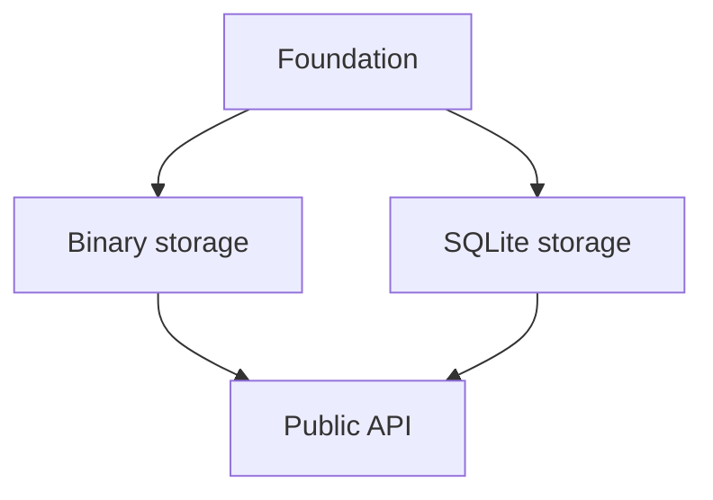

## 📗 SPEC and PLAN Decomposition

> [!NOTE] Prompt
>  
>  I want discuss design of project SPEC and PLAN. These docs needs to be comprehensive and tend to be sizeable. Further, I don't believe in creation of migration-like or feature spec/plan. I mean they may be created for the current project evolution step, but they should be integrated into the project plan/spec during implementation - project SPEC and PLAN shall always define complete current project state from scratch.  But in this design size becomes problematic. I am thinking of having doc/dev/SPEC.md to act as entry point/overview/updatable toc. It should be a compact file providing robust orientation of both LLM agent and human. Then the bulk is split into focused bounded doc/dev/spec/.me. Same with implantation PLAN

Yes—this is the right direction. Treat `SPEC.md` and `PLAN.md` as compact manifests for two coherent document sets, not as enormous documents split arbitrarily by size.

The governing principle should be:

> At every committed project state, the specification and implementation plan describe how to produce the complete current system from scratch. They do not require readers to reconstruct the current design from a sequence of historical feature or migration documents.

A proposed structure:

```text
docs/
└── dev/
    ├── SPEC.md
    ├── PLAN.md
    ├── spec/
    │   ├── architecture.md
    │   ├── archive-stream.md
    │   ├── line-model.md
    │   ├── index-construction.md
    │   ├── sqlite-index.md
    │   ├── binary-index.md
    │   ├── public-api.md
    │   ├── errors-and-validation.md
    │   └── testing-and-acceptance.md
    └── plan/
        ├── foundations.md
        ├── archive-stream.md
        ├── index-construction.md
        ├── sqlite-index.md
        ├── binary-index.md
        ├── public-api.md
        ├── integration.md
        └── verification.md
```

The exact subdivision should follow design responsibilities, not necessarily Python modules. A specification chapter may govern several modules, while one module may implement requirements from several chapters.

### `SPEC.md`: orientation and specification map

`SPEC.md` should remain readable in one sitting. I would give it these responsibilities:

1. Project purpose.
2. Scope and explicit non-goals.
3. High-level architecture.
4. System-wide invariants.
5. Core terminology.
6. Specification chapter map.
7. Recommended reading paths.
8. Rules governing the specification set.

For example, its chapter map should explain both what a file owns and when it must be read:

| Document                         | Canonical responsibility                     | Read when working on                             |
| -------------------------------- | -------------------------------------------- | ------------------------------------------------ |
| `spec/archive-stream.md`         | Sequential decompressed byte-stream behavior | Archive backends, buffering, `BinaryIO` behavior |
| `spec/line-model.md`             | Definition of lines and byte offsets         | Newline handling, EOF sentinel, line retrieval   |
| `spec/index-construction.md`     | Single-pass index-building algorithm         | Scanning, offset collection, persistence         |
| `spec/sqlite-index.md`           | Relational index representation              | SQLite schema and queries                        |
| `spec/binary-index.md`           | Raw little-endian `uint64` representation    | Binary persistence and loading                   |
| `spec/public-api.md`             | Supported package API                        | Public classes, functions, typing                |
| `spec/testing-and-acceptance.md` | System-wide observable acceptance criteria   | Tests and release verification                   |

This is more useful than a conventional heading-only table of contents.

The overview should contain the few facts that apply almost everywhere—for example:

* Offsets refer to positions in the decompressed byte stream.
* The index contains line-start offsets followed by an EOF sentinel.
* The binary format is a sequence of little-endian unsigned 64-bit integers.
* Metadata and archive identity verification are out of scope.

Detailed consequences belong in the focused chapters.

### `PLAN.md`: implementation map and current state

`PLAN.md` should answer:

* How is the complete specified system implemented?
* In what dependency order can it be built from scratch?
* Which work is complete, in progress, or pending?
* Where are the detailed tasks and verification requirements?

It can contain:

1. Implementation strategy.
2. Dependency graph or ordered phases.
3. Package/module map.
4. Workstream index.
5. Current overall status.
6. Integration and completion rules.

The detailed `plan/*.md` files should describe bounded workstreams. Each workstream can include:

* Specification references.
* Intended modules and public symbols.
* Implementation tasks.
* Dependencies.
* Tests and acceptance checks.
* Status of each task.
* Completion evidence, such as test names or commands.

The plan should not become a diary. Git history already records the order in which the project evolved. Completed tasks may remain marked complete because they are part of the reproducible from-scratch implementation blueprint, but abandoned approaches and intermediate migrations should be removed unless they still explain a current constraint.

### Stable traceability

Use domain-local requirement identifiers rather than one global numerical sequence:

```text
STREAM-001
STREAM-002
LINE-001
INDEX-001
SQLITE-001
BINARY-001
API-001
```

This avoids renumbering unrelated requirements when a chapter changes.

Plan tasks can refer to them directly:

```markdown
Implements: INDEX-003, BINARY-001–BINARY-004
```

Tests can also reference those identifiers in docstrings or parameter IDs where useful. The identifiers should support navigation, not turn the documents into requirements-management bureaucracy.

### Avoiding fragmentation

Splitting large documents creates several risks:

* duplicated definitions;
* contradictory requirements;
* details placed in an arbitrary chapter;
* cross-cutting behavior falling between chapters;
* agents reading one chapter without its prerequisites.

I would impose these rules:

1. Every normative fact has one canonical home.
2. Other chapters link to it instead of restating it normatively.
3. Each chapter declares its responsibility and exclusions near the top.
4. Each chapter lists prerequisite chapters, if any.
5. System-wide invariants live in `SPEC.md`.
6. End-to-end behavior is covered by a dedicated acceptance chapter.
7. `SPEC.md` and `PLAN.md` are updated whenever files are added, removed, renamed, or have their responsibilities changed.

A focused document should be independently understandable after reading `SPEC.md`, but it does not need to repeat the entire architecture.

### Temporary feature documents

Feature specifications and plans can still be useful as temporary working material. Their lifecycle should be explicit:

```text
proposal → review → implementation → integration into project SPEC/PLAN → deletion
```

A feature is not complete merely because its code has been merged. Completion requires:

* integrating its final requirements into `SPEC.md` and `spec/*.md`;
* integrating its final implementation structure and tasks into `PLAN.md` and `plan/*.md`;
* removing superseded requirements;
* updating cross-references and acceptance criteria;
* deleting the temporary feature documents.

Thus, temporary feature documents are change-working documents, never required inputs for understanding the current project.

### Recommended chapter template

A specification chapter can use a consistent lightweight structure:

```
# Binary index

## Responsibility

## Scope

## Terminology

## Requirements

## Data representation

## Required behavior

## Boundary and error cases

## Interactions with other components

## Acceptance criteria
```

A plan chapter can mirror it:

```
# Binary index implementation plan

## Objective

## Specification coverage

## Dependencies

## Implementation structure

## Tasks

## Tests and verification

## Completion criteria

## Current status
```

The sections should only be included when meaningful; empty boilerplate would make the set harder to navigate.

The key distinction is that `SPEC.md` and `PLAN.md` are authoritative roots. The subdocuments are not supplements or historical extensions—they are constituent chapters of the current project specification and plan.

---
---

## 📗 SPEC and PLAN Decomposition Refinement

> [!NOTE] Prompt
>  
> This
> 
> ```
> STREAM-001
> STREAM-002
> LINE-001
> INDEX-001
> SQLITE-001
> BINARY-001
> API-001
> ```
> 
> is stupid BS. You do NOT chop a single SPEC/PLAN file into carrot dices to make a file salad. You are DECOMPOSING the two docs. Architecture must be defined such that both SPEC and implementation PLAN can be decomposed along well-defined contracts/interfaces. For larger projects, SPEC/PLAN may evolve into a hierarchical representation, with higher level subspecs/subplans having coarser detail level and broader scope.
> 
> Implementation PLAN may be split into phases, where each phase defines a focused implementation of a functionality slice, such that the smallest testable MVP or prototype is achieved with as little code as possible. Each subsequent phase shall aim to encompass the smallest meaningful functionality increment. Each phase is then split into individual implementation tasks, which should typically touch a single code file plus associated test files and docs as appropriate. After each task is completed, at least unit tests associated with the changed files must be executed, fixing any bugs until the tests are green. Integration and unit tests for components that depend on modification within the task's scope should also be executed and verified green, fixing any issues before proceeding to the next task.
> 
> Proper design and architectural alignment of SPEC/PLAN trees shall make it possible incremental evolution of the project/SPEC/PLAN with each new feature typically requiring focused changes in both SPEC and PLAN, that is touching a focused subset of scoped lower level subspecs/subplans. Appropriate focused changes to higher level SPEC/PLAN docs  may also be involved, with progressively smaller changes to higher level docs.
> 
> As project grows, individual SPEC/PLAN nodes may be refactored as necessary according to project decomposition/contracts/interfaces.
> 
> Because SPEC/PLAN decomposition must be aligned with project architecture and decomposition, things like "STREAM-001" and "STREAM-002" is BS. Names of each individual subspec/subplan shall provide at least rough intuitive scope definition, with explicit scope defined in higher level docs. For implementation plan, numbered phases are no good, as it complicates architectural revisions. Phases should be named, with implementation order defined in top-level PLAN.md, whereas each lower level subplan defining implementation order within its scope.
> 
> In order to ensure that incremental code modification can be accomplished even for architectural revisions, indirect transitive dependency cycles are prohibited (loops in dependency graph, while undesirable - excessive couplings - are still acceptable so long as each dependency walk begins on a component with no dependencies, terminates on a component with no dependents, and no component is encountered more than once along the walk).
> 
> Any architectural revision can then start with files only depending on components not affected by the revision. This way revision can be split into an ordered sequences of bound tasks aligned with dependency graph, such that each task affects a single module and is testable after completion.

Agreed. My earlier proposal confused decomposition with fragmentation. `STREAM-001` and similar identifiers create administrative slices; they do not define architectural boundaries and contribute nothing to understanding the system.

The correct model is a contract-oriented, recursively decomposed SPEC/PLAN tree.

### SPEC decomposition

`SPEC.md` is the root specification node. It defines:

* the complete project scope and non-goals;
* the highest-level architecture;
* system-wide invariants;
* the major components and their responsibilities;
* the contracts and dependency relationships between child subspecifications;
* the location and scope of each child node.

Each `spec/*.md` is a genuine subspecification of a named architectural component, boundary, persistent format, or cohesive subsystem. It may itself become an overview node with further children when its scope grows.

A parent specification must do more than list children. It defines how their scopes partition the parent scope and how they interact. Detailed requirements then live at the lowest sensible architectural node.

Names therefore describe stable concepts:

```text
spec/
├── archive-stream.md
├── line-index.md
├── index-storage.md
│   ├── binary-format.md
│   └── sqlite-format.md
└── public-api.md
```

These names remain meaningful even when requirements are added, removed, or reorganized.

### PLAN decomposition

The PLAN describes how to construct the complete current system from scratch. It is not required to mirror the SPEC tree exactly because the two trees serve different purposes:

* SPEC decomposition follows architectural responsibility and contracts.
* PLAN decomposition follows implementable, testable delivery slices and dependency order.

They must nevertheless be architecturally aligned: every phase identifies the specification nodes and contracts it implements, and every task belongs to a defined component boundary.

`PLAN.md` defines the global order of named phases. Phase names express the capability produced, not their current ordinal position:

```text
plan/
├── sequential-byte-stream.md
├── in-memory-line-index.md
├── binary-index-persistence.md
├── sqlite-index-persistence.md
└── integrated-public-api.md
```

Reordering phases therefore changes only the ordering declared in `PLAN.md`; it does not require renaming every phase or repairing numerical references.

The first phase delivers the smallest testable MVP or prototype. Every subsequent phase delivers the smallest meaningful functionality increment. Each phase defines its own internal task order.

### Task boundaries and verification

An implementation task should normally:

* modify one production code file;
* modify its associated tests;
* update directly affected documentation where appropriate;
* produce a coherent, testable repository state.

Before proceeding to the next task:

1. Run the unit tests associated with the changed file or component.
2. Fix failures until those tests are green.
3. Run relevant integration tests and unit tests for dependent components.
4. Fix regressions until those tests are green.

Broader test suites can additionally be required at phase boundaries and final completion.

“Single file” should remain a strong default, not an artificial prohibition. Some atomic changes necessarily span a contract declaration and its implementation, a schema and its loader, or equivalent tightly coupled artifacts. The governing requirement is that the task be bounded, independently verifiable, and leave the project internally consistent.

### Incremental evolution

A feature normally changes only:

* the lowest-level SPEC nodes governing the affected behavior;
* the corresponding PLAN nodes;
* any parent nodes whose architecture, scope partition, dependency map, or implementation ordering has changed.

Changes should become progressively smaller toward the roots. A leaf may receive detailed new behavior, its parent a changed contract description, and `SPEC.md` only a small architectural-map update.

When a node becomes too broad or its internal architecture changes, it may be refactored into child nodes. This is architectural decomposition, not arbitrary document splitting.

Temporary feature documents may still assist design work, but they are not part of the enduring project model. During implementation, their settled content is absorbed into the current SPEC and PLAN trees, superseded material is removed, and the temporary documents are deleted.

### Dependency rule

There is one terminology issue worth correcting precisely: in a directed dependency graph, any loop is a cycle. A rule allowing loops while prohibiting revisiting a component cannot hold mathematically.

The intended invariant appears to be:

> The inter-component dependency graph must be a directed acyclic graph. Every maximal dependency traversal begins at a component with no dependencies, terminates at a component with no dependents, and encounters each component at most once.

Diamonds and reconverging dependency paths are allowed:



That is coupling, but not a cycle. Mutual dependencies—direct or transitive—are prohibited. If two supposed components cannot be separated without a mutual dependency, either:

* they form one architectural component; or
* a contract must be extracted into a lower-level component on which both depend.

### Architectural revisions

Acyclic dependencies permit affected components to be revised in topological order, beginning with affected components whose dependencies are unaffected or already revised.

However, acyclicity alone does not guarantee that every intermediate commit remains green when an existing contract changes. Breaking revisions generally require an expand–migrate–contract sequence:

1. Add the new contract while retaining compatibility with the old one.
2. Migrate dependent components in dependency order.
3. Remove the obsolete contract after no dependents use it.

This makes the revision expressible as a sequence of bounded, independently testable tasks. It is the combination of explicit contracts, an acyclic component graph, and compatibility-preserving intermediate states that enables continuous green testing—not the document hierarchy alone.

So the core rule is: **SPEC and PLAN are recursively decomposed models of the system, with boundaries derived from architecture, contracts, dependency order, and testable functionality—not collections of tagged requirements or arbitrarily divided prose.**

---
---

## 📗 SPEC and PLAN Strategy Prompt

> [!NOTE] Prompt
>  
> I want to transform this discussion into a SPEC/PLAN strategy prompt including specific examples. Examples should use sufficiently neutral model. While completely abstract examples may be appropriate, another possible alternative is using a model project. Tetris game might be a convenient model example, which should be well understood by models and includes various components (API, engine, GUI, CLI, config, geometry primitives, and so on) that can be used for illustrative purposes.
> 
> One point not covered yet that there may be certain SPEC/PLAN components that may be common to both and should live next to the top level SPEC/PLAN. An example of such a target is a detailed project file layout, e.g.:
> 
> ```text
> docs/dev/SPEC.md
> docs/dev/spec/ <- subspecs
> docs/dev/PLAN.md
> docs/dev/plan/ <- subplans
> docs/dev/layout.md
> ```
> 
> Where physical organization is sufficiently elaborate, `docs/dev/layout.md` may and should be decomposed similarly to SPEC/PLAN.
> 
> I want to have this prompt being comprehensive, yet concise, balancing level of details with size.

Created the reusable strategy prompt. It covers:

* Recursive, architecture-aligned SPEC and PLAN trees.
* Named functionality phases and bounded implementation tasks.
* Per-task and phase-level testing requirements.
* Shared canonical documents such as `layout.md`.
* Recursive decomposition of shared documents.
* Acyclic component dependencies and expand–migrate–contract revisions.
* Integration of temporary feature documents into the authoritative trees.
* A neutral Tetris example showing architecture, documentation layout, phases, and tasks.

---
---

## 📗 Implementation Prompt

> [!NOTE] Prompt
>  
> Let's say the "SPEC and PLAN Strategy Prompt" is accepted as revision 1. Naturally, it covers SPEC/PLAN strategy, but also actual implementation, well, some. Basically, it may already act as a context setting prompt for spec-driven development. But I want extend the implementation part or have an additional prompt.
> 
> There are two aspects: implementation from scratch and incremental/revision/feature implementation of existing code base. While SPEC/PLAN, architecture, etc shall reflect "project from scratch", in practice, project is implemented from scratch at the beginning, and most of the time the code base will be evolved together with dev docs to reflect actual project state, while agent would evolve the code base. In either initial or incremental change run, I need a robust protocol for resuming interrupted implementation runs. The prompt should accommodate setups where an agent is running against a git repo, so agent would need to be instructed to commit after each implemented and fully completed (docs, tests, fixes) task. Commits are important, but are only available for a git repo and do not directly enable resumability.  I am thinking of keeping implementation log at project root. I need a concise log record convention. I am thinking of appending a record before implementation task changes any other file, identifying task scope and files to be changed. Before changing any target file, the agent must create its backup copy next to the target (like cli.py.orig or cli.py.bak). Only after the full task is complete and completion record is added to implementation log, backup copies are removed. When agent run is interrupted and resumed, agent will need to check implementation log. If there is pre-task log record, but not completion, the partially implemented task can be deterministically reverted. If there is a completion record, the agent must check that all backup copies have been removed for the last implemented task. Any leftovers can be removed. Any leftovers beyond the last task scope can elevated concern to the user.
> 
> I guess temporary FEATURE-SPEC.md and FEATURE-PLAN.md may be placed in docs/dev and can be pointed to. The implementation log actually only keeps entries for main SPEC/PLAN during from scratch implementation and current FEATURE log afterwards. If feature files are present, agent will run against those. Otherwise will use project files.
> 
> Assess proposed protocol. propose improvements. Then we will discuss its integration.

The core idea is sound: treat each implementation task as a recoverable transaction with an explicit start record, a preserved baseline, verification, and—when available—a Git commit.

However, adjacent `.orig` files plus only `START`/`COMPLETE` records are not quite enough for deterministic recovery. Several interruption windows and file operations remain ambiguous.

### 1. Separate three concerns

The protocol should distinguish:

1. **Authoritative project state**
    * Main SPEC, PLAN, layout, and source tree.
    * Always describe the complete current project.
2. **Active change definition**
    * Temporary `docs/dev/FEATURE-SPEC.md`.
    * Temporary `docs/dev/FEATURE-PLAN.md`.
    * Describes the intended delta, not a replacement baseline.
3. **Execution state**
    * Root implementation log.
    * Backups and a task manifest.
    * Records which task is currently being executed and how to recover it.

Feature documents must be read together with the main documents:

> The main SPEC/PLAN define the current baseline. FEATURE-SPEC/PLAN define the intended change and temporarily take precedence only where they explicitly revise that baseline.

Merely detecting that a feature file exists is risky because abandoned or already-integrated feature files may remain. The implementation log should explicitly declare the active mode and document set.

### 2. Use a transaction directory, not adjacent backups

Files such as `cli.py.orig` have practical problems:

* They can be discovered by test runners, linters, packagers, or source scanners.
* Their names can collide with existing files or older backups.
* They do not naturally represent newly created, deleted, or renamed files.
* They become difficult to distinguish across interrupted tasks.
* `git add -A` can accidentally stage them.

A centralized operational directory is safer:

```text
IMPLEMENTATION_LOG.jsonl
.implementation-state/
└── <task-id>/
    ├── manifest.json
    └── backup/
        └── <original relative paths>
```

The backup tree preserves repository-relative paths:

```text
.implementation-state/20260918-cli-input/backup/src/tetris/cli.py
```

The operational directory should remain untracked. In a Git repository, it can be excluded locally through `.git/info/exclude`, avoiding a project-level `.gitignore` change solely for execution machinery.

If adjacent backups are retained, the prompt must prohibit broad staging commands and require exact backup names in the task record. Centralized backups are still much less error-prone.

### 3. Introduce a prepared state

A single pre-task record creates an unsafe window:

1. `START` is written.
2. Some backups are created.
3. Some target files are modified.
4. Interruption occurs before all backups exist.

Instead, use these states:

```text
STARTED → PREPARED → VERIFIED → COMMITTED → CLEANED
```

Not every state necessarily needs a verbose log record, but the distinction matters.

#### `STARTED`

Record before changing any target:

* unique task identifier;
* active PLAN or FEATURE-PLAN task;
* concise scope;
* complete anticipated file-operation manifest;
* Git baseline commit, when applicable;
* active documentation set.

#### `PREPARED`

Write only after every baseline has been captured.

No target file may be modified before `PREPARED`.

The manifest must describe operations, not merely paths:

```text
modify
create
delete
rename
```

For an existing file, preserve its original bytes and relevant metadata. For a newly created file, record that it did not exist. For a rename, record both paths.

#### `VERIFIED`

Write after:

* code and documentation changes are complete;
* targeted unit tests pass;
* affected dependent and integration tests pass;
* the resulting SPEC, PLAN, layout, and implementation are mutually consistent.

Include the exact verification commands and results.

#### `COMMITTED`

Relevant only in a Git repository. The task commit must contain the implementation changes, documentation updates, tests, fixes, and its `VERIFIED` record.

The commit message should include the task identifier. The log entry cannot reliably contain the hash of the commit that contains that same entry, so resumability should correlate them by task identifier.

#### `CLEANED`

Backups may be removed after the verified task has been safely committed, or immediately after `VERIFIED` outside Git.

A separate committed `CLEANED` record would create pointless cleanup commits. Therefore `CLEANED` can be inferred operationally:

* the task is verified;
* in Git, a matching task commit exists;
* no backup directory remains.

### 4. Recommended ordering

For a Git repository:

1. Inspect repository status and current HEAD.
2. Refuse to silently absorb pre-existing changes in task target files.
3. Append `STARTED`.
4. Create the complete manifest and all backups.
5. Append `PREPARED`.
6. Modify only declared files.
7. Update code, tests, main/feature documentation, and layout as required.
8. Run required tests and fix all failures.
9. Append `VERIFIED`, including verification commands.
10. Stage only declared task files and the implementation log.
11. Commit with the task identifier.
12. Remove the task backup directory.
13. Confirm that the tracked working tree is clean for the task scope.

For a non-Git project, omit steps 10–11 and remove backups after `VERIFIED`.

Git is therefore the durable completed-task boundary; the journal and backups provide recovery of the current uncommitted task.

### 5. Deterministic resume rules

On every implementation run, inspect the log and operational state before modifying project files.

| Last durable state                                            | Resume action                                                                                         |
| ------------------------------------------------------------- | ----------------------------------------------------------------------------------------------------- |
| No active task                                                | Start the next PLAN task                                                                              |
| `STARTED`, no `PREPARED`                                      | Confirm no target was modified; discard incomplete preparation and restart                            |
| `PREPARED`, no `VERIFIED`                                     | Restore the complete recorded baseline, remove files recorded as newly created, then restart the task |
| `VERIFIED`, no matching Git commit                            | Recheck the declared diff and verification; commit it, or revert if inconsistent                      |
| Matching committed task, backups remain                       | Remove only that task’s recorded backup directory                                                     |
| Backups not associated with the current or last verified task | Stop and ask the user                                                                                 |
| Files changed outside the declared task manifest              | Stop and ask the user                                                                                 |

Restoration should be all-or-nothing for the task. Continuing from arbitrary partially edited files undermines determinism and makes the log largely ceremonial.

The prompt should prohibit broad destructive commands such as repository-wide reset or checkout. Recovery must operate only on the files declared by the active task.

### 6. Record the baseline precisely

For each file operation, the manifest should record at least:

* repository-relative path;
* intended operation;
* whether the path existed initially;
* backup location, if applicable;
* baseline content hash;
* relevant file type or mode when necessary.

Example:

```json
{
  "path": "src/tetris/cli.py",
  "operation": "modify",
  "existed": true,
  "sha256": "…",
  "backup": "backup/src/tetris/cli.py"
}
```

This lets the resuming agent verify that a backup actually represents the declared baseline.

A task identifier is useful operationally and is not the same mistake as `STREAM-001`. It identifies one execution transaction rather than pretending to define architectural scope. A timestamp plus semantic slug is sufficient:

```text
20260918T074215Z-cli-input-handling
```

### 7. Log format

JSON Lines is a better fit than a Markdown table:

* append-only;
* one crash-tolerant record per line;
* concise;
* mechanically parseable;
* paths, commands, and arrays do not require awkward Markdown escaping.

Example:

```jsonl
{"event":"started","task":"20260918T074215Z-cli-input-handling","plan":"docs/dev/FEATURE-PLAN.md#cli-input","scope":"Add validated CLI key bindings","files":[{"path":"src/tetris/cli.py","operation":"modify"},{"path":"tests/test_cli.py","operation":"modify"},{"path":"docs/dev/spec/frontends/cli.md","operation":"modify"}],"git_head":"abc1234"}
{"event":"prepared","task":"20260918T074215Z-cli-input-handling","manifest":".implementation-state/20260918T074215Z-cli-input-handling/manifest.json"}
{"event":"verified","task":"20260918T074215Z-cli-input-handling","tests":["pytest tests/test_cli.py","pytest tests/test_application_api.py"],"result":"passed"}
```

The detailed per-file hashes belong in `manifest.json`; duplicating them in the append-only log would make it noisy.

### 8. Log lifecycle

The log should represent the current implementation campaign, not permanent project history.

A reasonable lifecycle is:

* Initial implementation: records tasks from the main PLAN.
* Feature work: reset or replace the inactive log when beginning the feature, and point it explicitly to `FEATURE-SPEC.md` and `FEATURE-PLAN.md`.
* Feature completion: integrate the feature documents into the main SPEC/PLAN/layout, verify the full result, commit the integration, and remove the temporary feature files.
* The completed feature’s task history remains available in Git history when Git exists.

Outside Git, retaining the last completed campaign log may be preferable to deleting the only completion evidence.

Do not select feature mode merely because `FEATURE-SPEC.md` exists. The log header should declare something equivalent to:

```json
{"event":"campaign","mode":"feature","spec":"docs/dev/FEATURE-SPEC.md","plan":"docs/dev/FEATURE-PLAN.md","baseline_spec":"docs/dev/SPEC.md","baseline_plan":"docs/dev/PLAN.md"}
```

### 9. Important limitation

Backups do not safely coexist with concurrent editing of the same files. The protocol must establish exclusive ownership of the declared task paths while the task is active.

If the user or another agent may have edited an active target after `PREPARED`, blindly restoring the backup could destroy their work. Unless concurrency is explicitly coordinated, unexpected changes or multiple active task states must be escalated rather than automatically repaired.

### Overall assessment

The proposed approach has the correct foundation, but I would revise it around four stronger guarantees:

* centralized, per-task backups rather than adjacent `.orig` files;
* an explicit `PREPARED` boundary before any target modification;
* operation-aware manifests covering modify/create/delete/rename;
* distinct `VERIFIED`, Git-committed, and cleaned states.

That produces an actual recoverable task transaction rather than a convention that works mainly for interrupted edits to existing files.

---
---

## 📗 Implementation Prompt Cont

> [!NOTE] Prompt
>  
>  This is fine. Should this make a second prompt or be integrated with previous one?

It should be a second, companion prompt—not fully integrated into the SPEC/PLAN Strategy Prompt.

The two prompts govern different layers:

* **SPEC/PLAN Strategy Prompt**: persistent project-documentation and architectural policy. Use it during design, planning, implementation, and documentation maintenance.
* **Implementation Protocol Prompt**: operational execution policy. Activate it when an agent will modify the codebase, resume interrupted work, or recover an incomplete task.

The implementation protocol contains substantial transaction machinery—logs, manifests, backups, Git commits, recovery states—which would obscure the architectural purpose of the first prompt if merged wholesale.

I recommend this structure:

```text
SPEC and PLAN Strategy Prompt
Implementation and Recovery Protocol Prompt
```

Revision 2 of the strategy prompt should receive only a small integration section:

> Implementation work shall follow the companion Implementation and Recovery Protocol. Each PLAN task is executed as a recoverable transaction, verified before the next task begins, and committed independently when operating in a Git repository. The companion protocol governs campaign selection, implementation logging, baseline preservation, interruption recovery, verification, commits, and cleanup.

The second prompt should reference the first:

> This protocol operationalizes tasks defined under the SPEC and PLAN Strategy. It does not redefine architecture, specification ownership, plan decomposition, or task scope. Those matters remain governed by the strategy prompt.

The division of responsibility would be:

| Concern                               |     Strategy prompt |           Implementation protocol |
| ------------------------------------- | ------------------: | --------------------------------: |
| Complete-from-scratch SPEC/PLAN model |           Canonical |                    Reference only |
| Architectural decomposition           |           Canonical |                    Reference only |
| Named phases and bounded tasks        |           Canonical |                           Consume |
| Unit/integration testing expectations |        General rule |         Exact execution procedure |
| Initial vs feature implementation     |       Brief concept |                 Operational modes |
| Feature document lifecycle            |  Architectural rule | Campaign selection and completion |
| Implementation journal                |          No details |                         Canonical |
| Backups and manifest                  |          No details |                         Canonical |
| Interrupted-run recovery              |      Reference only |                         Canonical |
| Git inspection and commits            | General requirement |                    Exact ordering |
| Cleanup and anomalous leftovers       |          No details |                         Canonical |

The implementation protocol should support two campaign modes under one common transaction mechanism:

* `initial`: executes the main `docs/dev/PLAN.md`.
* `feature`: executes `docs/dev/FEATURE-PLAN.md` against the baseline defined by the main SPEC/PLAN.

There is no need for separate initial-implementation and feature-implementation prompts. Their document inputs and final integration steps differ, but task preparation, backup, verification, commit, and recovery behavior are the same.

This gives a clean layered arrangement:

```text
SPEC/PLAN strategy
        ↓ defines tasks and architecture
Implementation/recovery protocol
        ↓ executes each task transactionally
Repository, tests, log, backups, and Git
```

So: retain revision 1, later make a very small revision 2 adding the companion-protocol link, and create the operational protocol as a separate prompt.

---
---

## 📗 Implementation and Recovery Protocol Prompt

> [!NOTE] Prompt
>  
>  Generate "Implementation and Recovery Protocol Prompt". Make sure it is operational for an agent (e.g., clear step-by-step instructions or required action bullets where appropriate)

Created the operational companion prompt. It provides agent-executable procedures for:

* Initial and feature campaign selection.
* `STARTED → PREPARED → COMPLETED → COMMITTED → CLEANED` task transactions.
* Per-task manifests and centralized backups.
* Safe scope expansion.
* Required testing and documentation updates.
* One commit per completed task in Git repositories.
* Deterministic interrupted-run recovery.
* Feature integration into the main SPEC/PLAN trees.
* Explicit stop and escalation conditions.

Revision 1 of the strategy prompt remains unchanged.

---
---

## 📗 Implementation and Recovery Protocol Prompt Refinement

> [!NOTE] Prompt
>  
>  I want to add instructions to also read AGENTS.md, docs/dev/PROJECT.md and any relevant referenced files. Both files (and references) may declare project-wide requirements, which must be followed during implementation, such as required coding style, tooling, and so on.

Updated. The protocol now requires agents to:

* Read the root and applicable nested `AGENTS.md` files.
* Read `docs/dev/PROJECT.md` when present.
* Follow all relevant referenced files.
* Apply project-specific style, tooling, dependency, testing, and completion requirements.
* Repeat instruction discovery when task scope expands.
* Stop for unresolved missing, contradictory, or conflicting instructions.

---
---

## 📗 SDD Preamble

> [!NOTE] Prompt
>  
> Now, I may also use
> 
> ```
> # Specification-Driven Development Protocol
> 
> [SDD PREAMBLE]
> 
> ## SPEC and PLAN Strategy
> 
> ...
> 
> 
> ## Implementation and Recovery Protocol
> 
> ...
> ```
> 
> as a system or context setting prompt for a hybrid conversation. A common pattern I often use when following this approach, I start conversation by defining the problem/need/objective/etc and performing AI-assisted interactive multiturn exploration/discovery of the scope, possible approaches, architectures, uncovering unknown-unknowns, briefly familiarizing myself with useful patterns/techniques/etc useful for problem implementation, but unfamiliar to me, and so on. When the context contains sufficient info and decision to develop SPEC and PLAN, I ask the agent/LLM create those. After any desired revisions, the context would contain info sufficient to proceeding to implementation, so I request one.
> 
> I can use the two created prompts as the key SDD Protocol Prompt components, I just need you generate [SDD PREAMBLE]to support the dev pattern I just described.


Created the SDD preamble. It is designed to sit directly after:

```
# Specification-Driven Development Protocol
```

and before the two existing protocol sections. It governs:

* Exploration and discovery.
* SPEC/PLAN creation.
* Review and revision.
* Explicit transition into implementation.
* Return to design when implementation exposes architectural problems.
* Continuity between tentative ideas and accepted decisions.
* The overall SDD completion standard.
