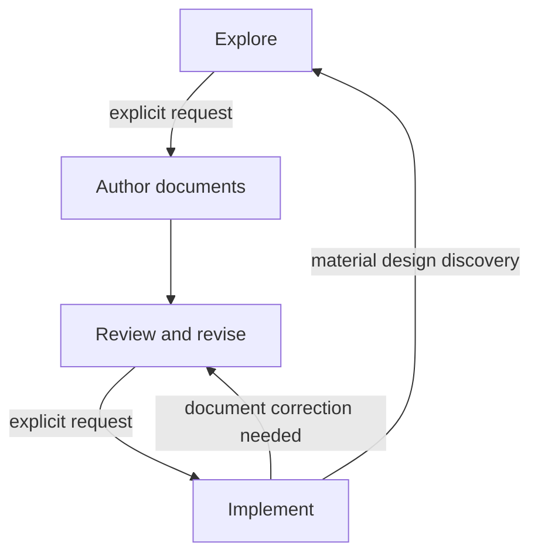

## 📗 Problem Statement

> [!NOTE] Prompt
>  
> I want transform my EXPLORE/SPEC/PLAN/IMPLEMENT prompts into elaborate Specification-Driven Development (sdd-man) skill. I want to start with the attached context:
> 
> - `Skill Template EXPLORE_DRIVE.md` - multiturn conversational exploratory developing skill development strategy
> - `Skill Template SPEC.md` - template skill specification, which should be used as a reference to be adapted
> 
> EXPLORE/SPEC/PLAN/IMPLEMENT prompts to be transformed into skill
> 
> - `SPI - EXPLORE.md`- multiturn conversational exploratory developing SPEC/PLAN/IMPLEMENT prompts
> - `implementation-and-recovery-protocol-prompt.md` - implementation prompt
> - `spec-plan-strategy-prompt.md` - SPEC and PLAN prompt
> - `specification-driven-development-preamble.md` governs the exploration preceding SPEC/PLAN generation.
> 
> As I see it now, the current prompts shall define the following workflows:
> 
> - Exploration
> - Layout generation
> - Specification generation
> - Plan generation
> - Greenfield resumable implementation
> - Brownfield/incremental/feature resumable implementation 
> - "Checkpoints" in git and non-git projects
> - Determination/discovery of git vs non-git projects
> - Testing strategy
> - Bug/failed tests fixing
> - Discovering current project status at startup
> - Resumption protocol
> - Journaling protocol establishing recovery from partially implemented feature due to agent interruption
> 
> What else (based on what current prompts define)? I will add new features after we have preliminary structure for the current scope.

Your list captures the main visible operations, but the current prompts define a broader lifecycle. Several important capabilities are also hidden inside what presently looks like “implementation” or “resumption.”

I would organize the preliminary scope into workflows, shared protocols, and system-wide invariants rather than treating every concern as an independent workflow.

### 1. Primary workflows

#### A. Exploration and decision formation

Already identified as **Exploration**, but the prompts define more than open-ended discussion:

* problem framing and vocabulary normalization;
* goals, scope, constraints, and non-goals;
* alternatives and tradeoff analysis;
* architecture, contract, data-model, and tooling exploration;
* separation of facts, user decisions, assumptions, unresolved questions, and rejected alternatives;
* contradiction and weak-boundary detection;
* compact decision-state summaries;
* explicit readiness assessment for specification;
* exploratory prototype classification:
    * disposable experiment outside the project;
    * actual project change governed by implementation protocol.

This is also responsible for preventing tentative ideas from becoming requirements accidentally.

#### B. Development-document authoring

This is better treated as one orchestrated workflow with three branches:

1. **LAYOUT generation or restructuring**
2. **SPEC generation or restructuring**
3. **PLAN generation or restructuring**

The branches share preliminary work:

* inspect an existing project when applicable;
* consolidate accepted exploration decisions;
* identify unresolved design blockers;
* determine the appropriate document-tree decomposition;
* assign every normative subject one canonical owner;
* generate complete-current-state documents rather than conversation summaries.

The documents need not be generated in a rigid order. For a greenfield project, a likely sequence is:

```text
accepted design
    ↓
high-level architecture and physical layout
    ↓
SPEC tree
    ↓
PLAN tree
    ↓
cross-tree consistency review
```

But SPEC design may reveal a better LAYOUT boundary, and planning may expose a missing specification contract. The workflow therefore needs controlled iteration rather than a strictly linear pipeline.

#### C. Review and revision

This is a distinct workflow missing from your list.

The preamble explicitly establishes a mode between document generation and implementation. It includes:

* reviewing generated SPEC, PLAN, and LAYOUT documents;
* applying user corrections as design changes rather than cosmetic edits;
* propagating changes through affected parent and child nodes;
* removing superseded content;
* rechecking architecture, dependency direction, testability, and task order;
* detecting contradictions among SPEC, PLAN, LAYOUT, and shared documents;
* remaining in review mode until implementation is explicitly requested.

This workflow should also support reviewing an existing document set without regenerating it.

#### D. Greenfield implementation campaign

Already identified. It includes:

* selecting the main SPEC and PLAN trees;
* constructing the system in dependency-ordered functionality phases;
* producing the smallest useful testable MVP first;
* executing one bounded PLAN task at a time;
* updating code, tests, and documentation together;
* phase closure;
* final campaign acceptance and completion.

#### E. Feature or revision campaign

Your brownfield workflow should explicitly cover both small features and architectural revisions:

* establish the main documentation and codebase as the baseline;
* use temporary `FEATURE-SPEC.md` and `FEATURE-PLAN.md` as the intended delta;
* determine precisely where feature documents override the baseline;
* support expand–migrate–contract changes;
* revise affected components in dependency order;
* maintain valid intermediate states;
* integrate settled requirements back into the authoritative trees;
* remove temporary feature documents at campaign completion.

This is materially different from merely “implementing in an existing repository.”

#### F. Existing campaign continuation

This deserves explicit recognition separate from ordinary recovery.

The protocol distinguishes:

* starting an initial campaign;
* starting a feature campaign;
* continuing a previously declared campaign.

When a campaign record already exists, it determines:

* campaign mode;
* active specification and plan;
* baseline document set;
* latest task;
* whether starting a different campaign is permitted.

Thus, “resume implementation” first resumes the campaign identity, then resolves the current transaction.

#### G. Document-only architectural evolution

The prompts allow design work without authorizing code modification. This workflow covers:

* splitting or merging SPEC nodes;
* reorganizing PLAN phases;
* decomposing or consolidating LAYOUT nodes;
* changing canonical ownership;
* correcting dependency direction;
* integrating feature design into authoritative documents before implementation.

It overlaps review and revision, but is useful as an explicit invocation because users may ask to restructure project documentation without starting an implementation campaign.

### 2. Discovery and assessment workflows

#### H. Project and authority discovery

This is broader than Git detection:

* locate the project root;
* locate `docs/dev/SPEC.md`, `PLAN.md`, LAYOUT, PROJECT, and feature documents;
* discover repository-root and directory-scoped `AGENTS.md`;
* follow referenced instruction files;
* determine which instructions apply to each anticipated target;
* detect missing, unreadable, contradictory, or ambiguous authorities;
* establish precedence among:
    * user request;
    * active feature documents;
    * authoritative main documents;
    * project instructions;
    * implementation protocol.

This should produce a compact **project authority map**.

#### I. Repository-capability discovery

This includes your Git/non-Git determination, but should also establish:

* repository root and current `HEAD`;
* tracked, staged, and untracked state;
* dirty target paths versus unrelated dirty paths;
* available build, test, lint, type-check, and packaging commands;
* generated-file and ignored-file policies;
* whether task commits are available;
* whether local exclusion of recovery data is possible;
* filesystem capabilities needed to preserve file type, executable state, and symlinks.

#### J. Project-state diagnosis

“Discover current project status at startup” should produce an explicit status classification:

* exploration only;
* specified but not planned;
* planned but not implemented;
* initial campaign not started;
* feature campaign not started;
* active task started but not prepared;
* active task prepared but incomplete;
* completed but uncommitted task;
* committed but not cleaned task;
* between tasks;
* phase complete;
* campaign complete;
* inconsistent or ambiguous state.

This diagnostic workflow should be usable independently—for example, “Tell me where this project stands”—without authorizing recovery or implementation.

#### K. Documentation/code conformance assessment

The completion standard implies a separate audit capability:

* compare documented behavior with implementation;
* compare PLAN tasks with actual implementation state;
* compare LAYOUT ownership with physical files;
* map tests to specified behavior and acceptance conditions;
* identify stale, missing, duplicated, or contradictory normative content;
* distinguish documentation drift from implementation defects;
* recommend whether the next action is exploration, document revision, implementation, or recovery.

### 3. Transactional implementation protocols

#### L. Task selection and preflight

This is more specific than implementation itself:

* identify the next incomplete task in declared order;
* load only relevant SPEC, PLAN, LAYOUT, feature, and instruction nodes;
* inspect affected code and tests read-only;
* bound the task;
* enumerate anticipated paths;
* classify operations as `create`, `modify`, `delete`, or `rename`;
* determine targeted, dependent, integration, and broader verification;
* detect collisions with pre-existing changes;
* create a stable task identifier.

#### M. Task preparation and baseline capture

A separate low-level protocol:

* append `STARTED`;
* calculate the baseline fingerprint;
* create the transaction directory;
* create and verify the manifest;
* back up existing targets;
* preserve bytes, file type, executable state, symlinks, and rename endpoints;
* append `PREPARED`;
* prohibit modification until preparation is durable.

#### N. Controlled scope extension

This is an explicit workflow in the recovery protocol and should not be hidden inside implementation:

* stop before modifying the newly discovered path;
* discover newly applicable instructions;
* journal the proposed extension;
* capture its baseline;
* version and re-hash the manifest;
* append another prepared record;
* resume only after the new scope is recoverable.

#### O. Task completion and durable closure

This covers more than checkpoints:

* inspect the resulting file scope;
* verify document/code/test consistency;
* execute the ordered verification ladder;
* append the completion record;
* stage only declared paths;
* create and verify the task commit when Git is available;
* retain recovery state if committing fails;
* remove backups only after durable completion;
* verify no task residue remains.

Git commits are therefore one form of durable task closure, not the entire checkpoint mechanism.

#### P. Controlled stop and rollback

The prompts define a controlled interruption path in addition to crash recovery:

* when verification cannot be completed;
* when implementation discovers a material design defect;
* when task scope becomes substantially larger;
* when a governing instruction is contradictory;
* when undeclared changes are discovered.

The default controlled stop restores the complete task baseline and journals `REVERTED`, unless the user explicitly directs retention of the prepared state.

#### Q. Evidence-preserving escalation

A recurring but important protocol:

* do not guess when the journal, manifest, filesystem, backups, or Git disagree;
* preserve recovery data;
* avoid destructive cleanup;
* report the exact inconsistency;
* request user direction when origin or ownership of changes is uncertain.

This is distinct from ordinary failure handling.

### 4. Verification and repair workflows

#### R. Verification-strategy derivation

Your “Testing strategy” should include:

* deriving tests from SPEC behavior and boundary conditions;
* associating unit tests with implementation files or components;
* identifying dependent-component tests;
* defining integration tests;
* selecting lint, type-check, build, packaging, and formatting checks;
* defining phase-level and campaign-level verification;
* distinguishing required checks from useful optional checks;
* ensuring every PLAN task has objective completion conditions.

#### S. In-task failure repair

“Bug/failed tests fixing” needs at least two modes:

1. **Task-caused failure**
    * repair within the current transaction;
    * keep the fix within declared behavior and scope;
    * extend scope safely when additional files are necessary;
    * repeat affected verification.
2. **Unrelated or pre-existing failure**
    * do not silently absorb it into the task;
    * establish whether it blocks required verification;
    * report it or create a later PLAN task;
    * avoid weakening tests merely to obtain a passing run.

#### T. Standalone defect campaign

A user may request a bug fix without existing feature documents. The skill needs to decide whether the defect:

* is already covered by the current SPEC and represents an implementation nonconformance;
* reveals an underspecified boundary;
* changes intended behavior and therefore requires feature specification;
* can be handled as a bounded corrective task;
* needs a temporary feature campaign.

That classification is currently implied but not named.

#### U. Acceptance and conformance verification

At phase or campaign completion:

* run declared acceptance scenarios;
* verify system-level acceptance conditions;
* verify SPEC, PLAN, LAYOUT, tests, and implementation agree;
* confirm temporary feature materials have been integrated and removed;
* confirm recovery state is clean;
* confirm every completed task has durable evidence.

### 5. Development-document management protocols

#### V. Recursive document decomposition

This applies independently to SPEC, PLAN, LAYOUT, and other shared documents:

* retain a focused node as one file;
* split only at meaningful responsibility or contract boundaries;
* turn the former document into an orienting parent;
* define child scope and relationships;
* keep roots useful rather than link-only;
* avoid arbitrary fragmentation and ordinal filenames;
* keep resources shallow enough for efficient context loading.

#### W. Canonical ownership and deduplication

The prompts strongly require:

* one canonical location per normative subject;
* links instead of duplicated normative prose;
* parent nodes defining relationships and boundaries;
* child nodes adding detail without broadening their assigned scope;
* removal of obsolete and superseded requirements;
* no use of miscellaneous shared documents as overflow containers.

#### X. Cross-tree traceability

Not requirement-ID traceability, but architectural routing:

* SPEC responsibility → implementation location;
* implementation location → test ownership;
* SPEC node → PLAN phase or phases;
* PLAN task → relevant SPEC contracts;
* physical area → governing LAYOUT node;
* feature delta → affected authoritative nodes.

The skill should preserve this without introducing artificial identifiers such as `STREAM-001`.

#### Y. LAYOUT refactoring

This is more than initial layout generation:

* inventory all physical-organization requirements;
* assign every item a destination;
* split by ownership domain rather than document size;
* keep docs, source, and tests separate when independently substantial;
* preserve packaging, generated-artifact, and runtime policies;
* repair cross-references;
* verify routine tasks require only a small focused context set.

#### Z. Temporary feature-document lifecycle

A complete workflow:

```text
create feature delta
→ review
→ implement against baseline + delta
→ correct approved discoveries
→ integrate final state into main trees
→ remove superseded content
→ delete temporary feature documents
```

Feature documents are not permanent historical records.

### 6. Architectural reasoning protocols

#### AA. Dependency analysis

The strategy defines:

* dependency graph construction;
* `A → B` meaning “B depends on A”;
* cycle detection;
* merging mutually dependent components or extracting a lower-level contract;
* identifying dependency-ordered implementation paths;
* allowing reconvergent and diamond dependencies.

#### AB. Incremental contract migration

For incompatible changes:

```text
expand
→ migrate dependents in dependency order
→ contract
```

Every intermediate task must remain internally consistent and testable.

#### AC. Design-discovery feedback

Implementation can uncover a missing or incorrect design decision. The workflow must:

* distinguish delegated implementation detail from architectural change;
* stop at a safe task boundary;
* return to exploration or specification revision;
* update authoritative documents;
* resume implementation only after the design is settled.

This prevents silent divergence from the specification.

### 7. Conversation and authorization protocols

#### AD. Mode and transition management

This is one of the most important missing items.

The skill must recognize and enforce:



In particular:

* exploration does not authorize document creation;
* document creation does not authorize implementation;
* a technical question does not imply a mode transition;
* an explicit implementation request may enter implementation directly if adequate documents already exist;
* ambiguous requests that would modify authoritative files require clarification.

#### AE. Truthful status and completion reporting

The preamble requires accurate labels such as:

* explored;
* specified;
* planned;
* under revision;
* partially implemented;
* blocked;
* reverted;
* completed.

The skill must never report a proposed design as implemented, a prepared task as completed, or unverified code as successful.

#### AF. Continuity and decision discipline

Across multiple turns:

* preserve settled terminology;
* avoid reopening decisions without new evidence;
* surface conflicts with earlier decisions;
* distinguish accepted and tentative conclusions;
* consolidate scattered conclusions before authoring documents;
* ensure the project remains understandable without conversation history.

### Recommended preliminary skill model

I would not expose all of these as equal top-level workflows. A cleaner orchestration model is:

| Top-level route      | Principal subworkflows                                               |
| -------------------- | -------------------------------------------------------------------- |
| **Explore**          | problem framing, alternatives, decision state, readiness             |
| **Inspect**          | project discovery, authority map, state diagnosis, conformance audit |
| **Design documents** | LAYOUT, SPEC, PLAN, feature documents                                |
| **Review documents** | consistency, propagation, decomposition, correction                  |
| **Implement**        | initial, feature, defect, or continuation campaign                   |
| **Recover**          | startup inspection, rollback, completed-task reconciliation          |
| **Verify**           | task, phase, campaign, acceptance, conformance                       |
| **Report status**    | current mode, campaign, phase, task, blockers, next action           |

Shared protocols would support those routes:

* authority and precedence;
* document ownership and decomposition;
* dependency ordering;
* transactional task execution;
* journaling and manifests;
* Git/non-Git durable completion;
* testing and failure classification;
* escalation and controlled stopping.

### Likely skill-package structure

Following the progressive-disclosure pattern demonstrated by the attached skill template, `SKILL.md` should primarily route work rather than contain the entire SDD manual:

```text
sdd-man/
├── SKILL.md
├── references/
│   ├── lifecycle-and-transitions.md
│   ├── exploration.md
│   ├── project-discovery.md
│   ├── document-architecture.md
│   ├── layout-workflow.md
│   ├── specification-workflow.md
│   ├── planning-workflow.md
│   ├── review-and-revision.md
│   ├── campaign-selection.md
│   ├── task-transaction.md
│   ├── recovery.md
│   ├── verification-and-repair.md
│   └── completion-and-integration.md
├── scripts/
│   ├── inspect_status.py
│   ├── prepare_task.py
│   ├── verify_transaction.py
│   └── recover_task.py
└── assets/
    ├── document-templates/
    └── journal-schemas/
```

The exact scripts should be decided later. However, deterministic handling of journals, manifests, hashes, backup verification, and status diagnosis is an especially strong candidate for executable helpers. Architectural judgment, exploration, and document decomposition should remain reference-guided agent workflows.

The most consequential additions to your original list are therefore:

* explicit mode and authorization transitions;
* review and revision;
* project-authority discovery;
* campaign selection and campaign identity;
* document/code conformance auditing;
* temporary feature-document lifecycle;
* task preflight and baseline preparation;
* controlled scope extension;
* controlled stop and rollback;
* evidence-preserving escalation;
* phase and campaign closure;
* dependency analysis and contract migration;
* cross-tree traceability and canonical ownership;
* truthful status reporting;
* design-discovery feedback from implementation.

---
---

## 📗 Roadmap

> [!NOTE] Prompt
>  
> Good. Now, I have been thinking about several things. The first one was suggested by the following turn occurred after partial implementation:
> 
> ```
> [!NOTE] Prompt
> 
> How may phases/milestones are/can be defined for the rest of the process?
> 
> There are **3 remaining top-level phases**, containing **25 implementation tasks**. The current phase structure is already coherent and does not need further top-level splitting.
> 
> | Remaining phase     |  Tasks | Suggested milestones |
> | ------------------- | -----: | -------------------: |
> | Archive streams     |     11 |                    5 |
> | Index persistence   |      7 |                    4 |
> | Package integration |      7 |                    3 |
> | **Total**           | **25** |               **12** |
> 
> #### Recommended milestone structure
> 
> ##### Phase 2: Archive streams
> 
> 1. **Archive test foundation**
>     * Shared generated archive fixtures and failure cases.
> 2. **ZIP support**
>     * ZIP streaming backend.
>     * Registry/public API integration.
>     * ZIP stream and index verification.
> 3. **TAR support**
>     * Seekable TAR handling.
>     * Non-seekable streaming TAR completion.
>     * Registry/public API integration.
>     * TAR, TGZ, TBZ, and related filter verification.
> 4. **7z support**
>     * Bounded queue protocol.
>     * `py7zr` extraction destination.
>     * Inspection and public error translation.
>     * Registry/public API integration.
> 5. **Archive lifecycle certification**
>     * Cross-format cleanup, early close, failure, ownership, integrity, and thread-lifecycle tests.
>     * Full archive-phase verification.
> 
> ##### Phase 3: Index persistence
> 
> 6. **Persistence validation foundation**
>     * Finalize offset validation shared by both formats.
> 7. **SQLite persistence**
>     * Atomic writing.
>     * Strict reading and validation.
>     * Existing-destination protection.
> 8. **Raw `uint64` persistence**
>     * Headerless little-endian writing.
>     * Strict reading, alignment checks, and validation.
>     * Atomic publication.
> 9. **Persistence API integration**
>     * Public exports.
>     * SQLite/raw equivalence.
>     * Persistence of indexes produced from every supported source format.
>     * Full persistence-phase verification.
> 
> ##### Phase 4: Package integration
> 
> 10. **Distribution surface**
>      * Final exports.
>      * `py7zr` dependency constraints.
>      * Build metadata.
>      * User README and examples.
> 11. **Operational hardening**
>      * Large-input and backpressure verification.
>      * Cross-platform filesystem and cleanup behavior.
> 12. **Release acceptance**
>      * Wheel and source-distribution builds.
>      * Clean installed-package workflows.
>      * Plain, ZIP, TAR, 7z, SQLite, and raw end-to-end tests.
>      * Documentation reconciliation and complete SPEC acceptance review.
> 
> So the useful hierarchy is:
> 
> * **3 phases** — major architectural capabilities.
> * **12 milestones** — meaningful stopping/review points.
> * **25 task transactions** — the individually backed-up, tested, logged units required by the implementation protocol.
> 
> The next natural stopping point would be **Milestone 2: ZIP support**, rather than waiting for the entire archive phase.
> ```
> 
> "Recommended milestone structure" is essentially a roadmap which must be exactly aligned with implementation plan. Further, this items of this road map can be transformed into checked list. The coding agent will have to check a completed task before or after adding a completion record to the journal. At start, coding agent will use it as a second (or first) source of project status, confirming from the PLAN and journal. This roadmap can be created after PLAN is created as a separate workflow or subworkflow referenced from the planning workflow. The roadmap would greatly facilitate progress inspection by human and enable HIL implementation where agent is instructed to implement, e.g., the next phase, the next N phases or M tasks.
> 

Yes. The roadmap should become a first-class SDD artifact—but specifically a derived execution-control view, not another source of requirements.

The important distinction is:

| Artifact                   | Authority                                                                     |
| -------------------------- | ----------------------------------------------------------------------------- |
| **SPEC**                   | Required final system                                                         |
| **PLAN**                   | Canonical phases, milestones, tasks, ordering, dependencies, and verification |
| **ROADMAP**                | Human-readable projection of PLAN structure and durable completion status     |
| **Implementation journal** | Transaction-level execution and recovery state                                |
| **Git history**            | Durable task commits when Git is available                                    |

### Recommended artifact

Use:

```text
docs/dev/ROADMAP.md
```

alongside:

```text
docs/dev/
├── SPEC.md
├── spec/
├── PLAN.md
├── plan/
├── ROADMAP.md
├── layout.md
└── layout/
```

`ROADMAP.md` should be compact enough to inspect in one pass. Unlike PLAN, it should not repeat detailed implementation instructions, file lists, test commands, or architectural rationale.

### PLAN must own milestones

The roadmap should not invent milestone boundaries after planning. Otherwise milestones become planning decisions stored only in a derived status document.

The revised hierarchy should be:

```text
PLAN
└── phases
    └── milestones
        └── task transactions
```

Each level has a different purpose:

* **Phase**: major independently meaningful project capability.
* **Milestone**: coherent review, handoff, or stopping point within a phase.
* **Task**: smallest recoverable implementation transaction.

The PLAN should canonically define:

* phase order;
* milestone order within each phase;
* task order within each milestone;
* milestone exit verification;
* phase exit verification.

The roadmap then mirrors that hierarchy exactly.

### Roadmap derivation workflow

After PLAN generation or material restructuring, run a dedicated **roadmap derivation** subworkflow:

1. Read the complete PLAN tree.
2. Identify every phase, milestone, and task.
3. Preserve their canonical order.
4. Verify that every PLAN task appears exactly once in the roadmap.
5. Verify that the roadmap introduces no task, dependency, or verification requirement absent from PLAN.
6. Link each roadmap item to its canonical PLAN section.
7. Add summary counts for phases, milestones, and tasks.
8. Initialize completion state from verified project evidence.
9. Validate the roadmap against the PLAN before reporting it complete.

For a newly planned greenfield project, every item normally begins unchecked.

For an existing project, checkmarks must be reconstructed from durable evidence rather than inferred from the apparent code state.

### Suggested roadmap form

```
## Project Roadmap

### Authority

This roadmap is a derived implementation-progress view.

- `PLAN.md` and its child documents define canonical implementation scope,
  ordering, dependencies, and verification.
- This roadmap mirrors every phase, milestone, and task exactly once.
- A checked task indicates durable completion under the implementation and
  recovery protocol.
- The implementation journal governs active and interrupted task state.

### Progress

| Phase | Milestones | Tasks | Completed |
|---|---:|---:|---:|
| Archive streams | 5 | 11 | 3 |
| Index persistence | 4 | 7 | 0 |
| Package integration | 3 | 7 | 0 |
| **Total** | **12** | **25** | **3** |

### Archive streams

- [ ] **Archive test foundation**
  - [x] [Generate shared archive fixtures](plan/archive-streams.md#generate-shared-archive-fixtures)
  - [x] [Add malformed-archive fixtures](plan/archive-streams.md#add-malformed-archive-fixtures)

- [ ] **ZIP support**
  - [x] [Implement ZIP streaming backend](plan/archive-streams.md#implement-zip-streaming-backend)
  - [ ] [Integrate ZIP with the source registry](plan/archive-streams.md#integrate-zip-with-the-source-registry)
  - [ ] [Verify ZIP indexing](plan/archive-streams.md#verify-zip-indexing)
```

The precise formatting can be settled later. The essential property is exact, mechanically checkable correspondence with PLAN.

### Checkbox semantics

Use only binary durable states in the persisted roadmap:

* `[ ]` — not durably complete;
* `[x]` — durably complete.

Do not use the roadmap checkbox to represent:

* currently active;
* prepared;
* verified but not committed;
* blocked;
* partially implemented;
* reverted.

Those states belong to the journal and recovery data. Adding transient states to the roadmap would make it another transaction ledger and increase reconciliation complexity.

A milestone is checked only when:

* all its tasks are durably complete; and
* its milestone-level verification has passed.

A phase is checked only when:

* all its milestones are durably complete; and
* its phase-level verification has passed.

The complete roadmap is checked only when campaign acceptance has passed.

### When a task checkbox changes

The roadmap should be part of every implementation task’s declared transaction scope. The safe sequence is:

1. Implement the declared task.
2. Update tests and authoritative documents.
3. Run task verification.
4. If applicable, run milestone or phase exit verification.
5. Mark the task checked in `ROADMAP.md`.
6. Mark its milestone or phase checked if its exit conditions are satisfied.
7. Update roadmap counts.
8. Append the journal `completed` record.
9. Commit the task, journal record, roadmap, code, tests, and documentation together when Git is available.
10. Remove recovery state after durable completion.

This ordering has useful recovery behavior:

* If interrupted before the `completed` record, the transaction is incomplete and recovery restores the earlier unchecked roadmap.
* If interrupted after `completed` but before the commit, recovery sees a completed transaction and performs completed-task reconciliation.
* The task commit contains the implementation and the corresponding progress transition together.
* In a non-Git project, the completion record plus the resulting roadmap state form the durable completion evidence.

The roadmap should therefore be included in the anticipated file set during task preflight.

### Startup and resumption precedence

The roadmap can be read first for fast human or agent orientation, but it must not be trusted first for execution decisions.

The safe startup order is:

1. Inspect journal and recovery data.
2. Inspect Git state and matching task commits when applicable.
3. Resolve or recover any active transaction.
4. Read the roadmap for summarized progress.
5. Compare roadmap checkmarks with journal and commit evidence.
6. Compare the next unchecked roadmap task with PLAN ordering.
7. Begin work only after all three agree.

Conceptually:

```text
journal + recovery + Git
        determine transactional truth
                    ↓
ROADMAP
        summarizes durable progress
                    ↓
PLAN
        confirms canonical next work
```

PLAN and roadmap play complementary roles:

* PLAN says what should be implemented and in what order.
* Roadmap says which planned boundaries have been durably crossed.
* Journal says what happened to the current or latest task.

### Reconciliation rules

At startup, validate at least these invariants:

* Every roadmap task maps to exactly one PLAN task.
* Every PLAN task maps to exactly one roadmap task.
* Relative ordering is identical.
* A checked task has a corresponding durable completion record.
* In Git, a checked task also has its required task commit.
* An unchecked task is not treated as complete merely because code resembling it exists.
* A checked milestone has no unchecked child task.
* A checked phase has no unchecked child milestone.
* Summary counts equal checkbox state.
* The next incomplete task agrees with PLAN ordering.

If the roadmap disagrees with the journal or Git:

* do not silently modify checkmarks;
* determine whether this is an interrupted completed-task transition, stale roadmap state, missing commit, or corrupted history;
* repair it through the appropriate recovery or reconciliation transaction;
* escalate when ownership or origin is uncertain.

A roadmap mismatch is therefore a project-state inconsistency, not merely a formatting error.

### Human-in-the-loop execution boundaries

This gives `sdd-man` a clean set of bounded implementation requests:

* implement the next task;
* implement the next `N` tasks;
* complete the current milestone;
* implement the next milestone;
* complete the current phase;
* implement the next phase;
* implement through a named milestone;
* implement through a named phase;
* report progress without implementing;
* resume the active campaign;
* stop after the MVP milestone.

The selection semantics should be precise.

#### “Next N tasks”

Execute the next `N` incomplete tasks in canonical PLAN order. Each task remains an independent transaction with its own:

* preparation;
* backup manifest;
* verification;
* journal completion;
* commit where available;
* cleanup.

`N` tasks do not become one large transaction.

#### “Next milestone”

Execute all remaining tasks through the end of the next incomplete milestone, including milestone verification.

If the current milestone is partially complete, “next milestone” should normally mean complete that current milestone, not skip to the following one.

#### “Next phase”

Execute all remaining tasks through the end of the current incomplete phase, including milestone and phase verification.

Again, if work is already partway through a phase, the boundary means completion of that phase rather than completion of an additional full phase.

#### “Next N milestones/phases”

Count incomplete boundaries from current durable progress. Execute tasks sequentially until the requested number of boundaries has been completed.

#### Named boundary

For example:

> Implement through Archive lifecycle certification.

Resolve the named boundary in PLAN and ROADMAP, verify it is unambiguous, and execute all incomplete prerequisite tasks through that boundary.

### Stop semantics

After reaching the user-selected boundary, the agent should stop only at a clean task boundary:

* no active task;
* all requested tasks verified;
* matching commits present where applicable;
* recovery data cleaned;
* roadmap updated;
* requested milestone or phase exit verification completed;
* concise progress report provided.

If execution is blocked inside a task, the controlled-stop rules still apply. The agent should restore the incomplete task unless the user explicitly authorizes retaining its prepared state.

### Progress reporting

The roadmap enables concise reports such as:

> Phase 2 is 6/11 tasks complete. ZIP support is complete. TAR support is the active milestone, with 1/3 tasks complete. The next task is non-seekable streaming TAR support.

A status report should reconcile:

```text
PLAN structure
+ ROADMAP checkmarks
+ journal state
+ Git durability
= reported project status
```

It should not derive progress only from checkbox counts.

### Required additions to the preliminary skill model

This adds three capabilities to the earlier scope.

#### Roadmap generation and maintenance

A subworkflow of planning and project evolution:

* derive `ROADMAP.md` from PLAN;
* update it when PLAN structure changes;
* validate exact structural correspondence;
* maintain completion rollups.

#### Bounded implementation orchestration

A subworkflow of implementation:

* resolve human-selected task, milestone, or phase boundaries;
* execute constituent tasks as separate transactions;
* stop at the requested durable boundary.

#### Progress inspection and reconciliation

A subworkflow of project inspection:

* compare PLAN, roadmap, journal, recovery state, and Git;
* calculate durable progress;
* identify the next task and next useful stopping point;
* detect and resolve status drift.

### Likely deterministic helper

This is a strong candidate for a skill script, perhaps:

```text
scripts/roadmap.py
```

Possible operations:

```console
python scripts/roadmap.py generate --project <root>
python scripts/roadmap.py validate --project <root>
python scripts/roadmap.py status --project <root>
python scripts/roadmap.py next --project <root>
```

Later it could also validate a proposed completion transition:

```console
python scripts/roadmap.py complete \
    --project <root> \
    --task <semantic-task-reference>
```

I would initially keep actual checkbox mutation under the transactional implementation workflow, with the script validating or performing the deterministic edit. The agent should still decide phase and milestone structure during planning; the script should never invent those architectural groupings.

So the core principle should be:

> **PLAN defines the route, ROADMAP exposes the route and durable progress to humans, and the journal makes each movement along that route recoverable.**

---
---

## 📗 Tests Registry

> [!NOTE] Prompt
>  
> When agent creates tests, it creates those for specific targets. When later specific tests are executed, the AI needs to pinpoint appropriate tests. This can be done, of course by analyzing imports. But does it make sense to define some kind of JSON registry mapping to map specific components to corresponding tests. I guess this can also be constructed from scratch deterministically more or less, but agent could add records immediately after creation of test modules and cases. Or how should this be handled? 

Yes, a registry makes sense—especially for a large, componentized project—but it should map components to verification targets, not attempt to map every source function to individual test cases.

I would call it a **verification map**, because the same mechanism should eventually cover integration tests, type checks, builds, packaging checks, and other component-specific verification.

### Recommended artifact

```text
docs/dev/verification-map.json
```

Its responsibility would be:

> Map the implemented project’s architectural components and physical source areas to stable, executable verification targets.

It would complement, rather than replace, PLAN verification requirements.

| Source           | Responsibility                                                 |
| ---------------- | -------------------------------------------------------------- |
| SPEC             | Defines required behavior and acceptance conditions            |
| PLAN             | Defines verification required by tasks, milestones, and phases |
| LAYOUT           | Defines component and physical ownership                       |
| Verification map | Resolves implemented components and paths to runnable checks   |
| Test suite       | Executable verification truth                                  |
| Journal          | Records the exact checks actually executed                     |

### Why import analysis is insufficient

Imports are useful evidence, but they cannot reliably discover:

* black-box CLI tests;
* protocol or interface conformance tests;
* tests using dynamic imports;
* integration tests spanning several components;
* persistence compatibility tests;
* tests driven through public APIs rather than direct imports;
* packaging and installed-distribution tests;
* dependency injection and plugin tests;
* subprocess tests;
* tests whose fixtures construct a component indirectly;
* tests covering external formats or behavioral contracts.

Import analysis should therefore assist registry construction and validation, but not be the sole mechanism.

### Appropriate granularity

The registry should normally map:

```text
component
→ source paths
→ unit-test targets
→ integration-test targets
→ other verification targets
```

It should not normally map:

```text
individual function
→ individual test case
```

Case-level selectors are too fragile:

* test names change;
* parameterized node IDs change;
* tests often cover multiple behaviors;
* implementation functions may be refactored without changing the contract;
* maintaining the registry becomes more expensive than locating the tests.

Individual test selectors should be recorded only when they are intentionally stable and useful—for example, isolating an expensive acceptance scenario.

### Suggested normalized structure

A normalized structure avoids duplicating commands across components:

```json
{
  "schema_version": 1,
  "components": {
    "archive.zip": {
      "paths": [
        "src/archive_line_index/archive/zip.py"
      ],
      "verification_targets": [
        "archive.zip.unit",
        "archive.zip.integration"
      ]
    },
    "index.builder": {
      "paths": [
        "src/archive_line_index/index.py"
      ],
      "verification_targets": [
        "index.builder.unit",
        "archive.zip.integration"
      ]
    }
  },
  "verification_targets": {
    "archive.zip.unit": {
      "kind": "unit",
      "command": [
        "python",
        "-m",
        "pytest",
        "tests/archive/test_zip.py"
      ]
    },
    "index.builder.unit": {
      "kind": "unit",
      "command": [
        "python",
        "-m",
        "pytest",
        "tests/test_index.py"
      ]
    },
    "archive.zip.integration": {
      "kind": "integration",
      "command": [
        "python",
        "-m",
        "pytest",
        "tests/integration/test_zip_index.py"
      ]
    }
  }
}
```

Using argument arrays instead of shell command strings avoids quoting and cross-platform shell ambiguities.

A test target may cover multiple components without duplicating its command.

### Dependencies and affected tests

There are two possible designs.

#### Option 1: Include component dependencies

```json
{
  "components": {
    "archive.zip": {
      "paths": ["src/archive_line_index/archive/zip.py"],
      "dependents": ["source.registry", "index.builder"],
      "verification_targets": ["archive.zip.unit"]
    }
  }
}
```

This is convenient, but duplicates architectural dependency information that may already belong in SPEC, LAYOUT, or another structured component map.

#### Option 2: Keep dependencies separately

Preferably, component dependencies remain canonically defined elsewhere, while the verification map only assigns checks to components.

Test selection then combines:

```text
changed paths
→ owning components
→ architectural dependents
→ verification targets for affected components
```

This avoids making the verification map another architecture registry. If `sdd-man` eventually introduces a machine-readable component map, the verification map should reference its stable semantic component names.

### Test selection algorithm

For an implementation task, the agent should select verification in this order:

1. Map changed production paths to their owning components.
2. Select those components’ direct unit-test targets.
3. Identify affected dependent components.
4. Select dependent-component tests.
5. Select integration targets crossing affected component boundaries.
6. Add checks explicitly required by the active PLAN task.
7. Add project-instruction checks required by `AGENTS.md`, `PROJECT.md`, or equivalent sources.
8. Add milestone, phase, or campaign checks when completing such a boundary.
9. Deduplicate commands.
10. Execute them from narrowest to broadest.

Conceptually:

```text
changed paths
      ↓
owning components
      ↓
direct tests + dependent tests + integration tests
      ↓
PLAN and project-required checks
      ↓
ordered verification set
```

The map provides a minimum candidate set, not permission to ignore other relevant tests.

### Incremental maintenance

Your proposal to register tests when they are created is the right model.

When a task:

* creates a production component;
* creates a test module;
* moves source or test files;
* changes component responsibility;
* introduces a new integration boundary;
* adds a new verification command;
* deletes or consolidates tests;

the same task should update `verification-map.json`.

The verification map becomes part of the task’s declared transaction scope, just like the roadmap.

A task creating a new test module would therefore normally modify:

```text
production target
test module
verification-map.json
possibly PLAN/SPEC/LAYOUT
ROADMAP.md
IMPLEMENTATION_LOG.jsonl
```

The registry update should happen before the task is recorded complete.

### Greenfield behavior

The verification map should represent the implemented current project, not speculative files that do not yet exist.

For a greenfield project:

1. PLAN defines the tests that future tasks must create.
2. The initial repository/testing task creates the verification map.
3. Each implementation task adds entries when the corresponding source and test targets become real.
4. Completion validation confirms that every changed production component has appropriate registered verification.

This keeps the map executable at every committed task boundary.

Avoid filling it with planned paths whose files will not exist until much later unless the schema explicitly supports planned entries. PLAN already carries that future intent.

### Brownfield bootstrap

For an existing project without a verification map:

1. Discover test configuration and test roots.
2. Collect tests using the project’s test runner.
3. Analyze naming, imports, fixtures, markers, coverage configuration, and directory correspondence.
4. Propose component ownership and verification-target mappings.
5. Validate that every registered command collects or executes at least one check.
6. Review ambiguous integration or black-box mappings.
7. Commit the verified map as a bounded documentation/tooling task.

This construction can be largely deterministic, but the agent should not pretend that imports prove behavioral coverage.

### Registry validation

A deterministic helper should validate:

* valid JSON and supported schema version;
* unique component and verification-target names;
* valid repository-relative paths;
* no duplicate path ownership unless explicitly allowed;
* every referenced verification target exists;
* every command is a nonempty argument array;
* registered test paths exist;
* test commands successfully collect at least one test;
* no deleted or renamed test remains referenced;
* every production path covered by the project’s mapping policy has an owner;
* no unexpected orphan verification targets exist.

For pytest, validation could use collection without running tests:

```console
python -m pytest --collect-only tests/archive/test_zip.py
```

Equivalent adapters can be used for other runners.

### Generated index versus maintained registry

There are really two useful artifacts:

#### Maintained verification map

```text
docs/dev/verification-map.json
```

Contains stable semantic relationships intentionally maintained with the project.

#### Generated test index

A disposable derived index can contain:

* collected test node IDs;
* imported modules;
* markers;
* parameterizations;
* collection counts;
* perhaps coverage-derived relationships.

It should be regenerated when needed and normally should not be committed. Individual collected test cases change too frequently to be good canonical project metadata.

Thus:

```text
maintained map = semantic test ownership
generated index = current test-runner details
```

### Recording verification in the journal

For reproducibility, a completed task record should include:

* exact commands executed;
* successful results;
* verification-map schema version;
* preferably the map’s content hash or Git blob state;
* whether selection included direct, dependent, integration, milestone, or phase checks.

For example:

```json
{
  "event": "completed",
  "task": "20260920T104200Z-zip-registry-integration",
  "verification_map_version": 1,
  "verification_map_sha256": "...",
  "verification": [
    {
      "target": "archive.zip.unit",
      "command": [
        "python",
        "-m",
        "pytest",
        "tests/archive/test_zip.py"
      ],
      "result": "passed"
    },
    {
      "target": "archive.zip.integration",
      "command": [
        "python",
        "-m",
        "pytest",
        "tests/integration/test_zip_index.py"
      ],
      "result": "passed"
    }
  ]
}
```

The journal records what actually ran; the verification map determines what should ordinarily be selected.

### Conflict handling

If the map, PLAN, and repository disagree:

* PLAN-required verification cannot be omitted because the map lacks it.
* A registered command that no longer collects tests is a map defect.
* A new test module omitted from the map must be classified before completion.
* A production component with no mapped direct test requires either:

  * a mapping;
  * an explicit explanation that it is verified indirectly;
  * or a documented exemption.
* The task cannot be declared complete while required verification routing is inconsistent.

### Recommended scope rule

I would not require a verification map for every tiny project. It becomes worthwhile when one or more of these are true:

* source-to-test correspondence is not obvious;
* several test levels exist;
* components have multiple dependents;
* the test suite is expensive enough that targeted selection matters;
* integration tests span multiple packages;
* repeated agents must rediscover the same commands;
* project status and resumption need deterministic test selection.

For small projects with a handful of source and test files, LAYOUT plus PLAN may remain sufficient.

### Addition to `sdd-man`

This introduces three related subworkflows:

#### Verification-map creation

* derive components from SPEC and LAYOUT;
* discover existing tests;
* define reusable verification targets;
* validate every mapping.

#### Verification-map maintenance

* update the map transactionally whenever source or test ownership changes;
* validate collection before task completion;
* remove obsolete mappings.

#### Impact-based verification selection

* resolve changed paths to components;
* expand through dependents;
* select direct and integration checks;
* merge PLAN and project-required checks;
* run from narrowest to broadest;
* record the resolved commands in the journal.

A likely skill helper would be:

```text
scripts/verification_map.py
```

with operations such as:

```console
python scripts/verification_map.py validate --project <root>
python scripts/verification_map.py affected --project <root> --path <path>
python scripts/verification_map.py select --project <root> --path <path>
python scripts/verification_map.py collect-check --project <root>
```

The core principle should be:

> Maintain stable component-to-verification ownership explicitly; derive volatile test-case details from the test runner when needed.

---
---

## 📗 Intermediate Reports

> [!NOTE] Prompt
>  
>  I also want to explicitly require that each task/milestone/phase completion report must provide a summary of implemented features.

Agreed. This should be a mandatory **completion-reporting contract**, separate from the journal’s machine-readable state.

Every reported completion must explain what capability now exists—not merely which files changed or which tests passed.

### Reporting levels

#### Task completion report

Summarize the incremental features or enabling capabilities delivered by that task.

Required content:

* task name;
* implemented features;
* verification result;
* resulting roadmap progress;
* next task or reached stopping boundary.

Example:

> **Task complete: Implement ZIP streaming backend**
>
> Implemented features:
>
> * Opens the single supported member as a sequential binary stream.
> * Rejects empty and multi-member ZIP archives.
> * Preserves caller ownership of externally supplied streams.
> * Cleans up archive resources on normal close and extraction failure.
>
> Verification: 24 ZIP backend unit tests passed.
>
> Progress: 4/11 Archive streams tasks complete. Next: integrate ZIP with the source registry.

A task that only establishes infrastructure must still describe its delivered capability:

> Implemented features:
>
> * Added reusable generated fixtures for valid, empty, multi-member, truncated, and corrupted archives.
> * Established shared assertions for stream ownership and cleanup behavior.

Do not falsely present enabling infrastructure as an end-user feature.

#### Milestone completion report

Provide an integrated summary of the capability delivered by all tasks in the milestone. Do not merely concatenate task reports.

Required content:

* milestone name;
* integrated feature summary;
* supported behavior and important guarantees;
* milestone-level verification;
* roadmap progress;
* next milestone or stopping point.

Example:

> **Milestone complete: ZIP support**
>
> Implemented features:
>
> * ZIP archives containing one text member can now be opened as sequential binary streams.
> * ZIP sources are available through the public source registry and indexing API.
> * Empty, multi-member, malformed, encrypted, and corrupted archives produce public package errors.
> * Early close, ownership, integrity, and cleanup behavior are verified.
>
> Verification: ZIP unit and integration suites passed, including stream-to-index workflows.
>
> Progress: 2/5 Archive streams milestones complete. Next: TAR support.

#### Phase completion report

Summarize the major project capability now available as a result of the whole phase.

Required content:

* phase name;
* complete implemented capability;
* supported public workflows;
* cross-component guarantees;
* phase acceptance results;
* cumulative roadmap status;
* remaining phases or campaign completion status.

Example:

> **Phase complete: Archive streams**
>
> Implemented features:
>
> * Sequential decompressed binary streams are available for ZIP, TAR-family, and 7z archives.
> * All archive formats integrate with the same public source and indexing interfaces.
> * Single-member validation, public error translation, bounded buffering, early close, ownership, and cleanup semantics are consistent across formats.
> * Index generation is verified for plain, ZIP, TAR, compressed TAR, and 7z sources.
>
> Phase acceptance: all archive backend, lifecycle, cross-format, and indexing tests passed.
>
> Progress: 2/4 phases and 18/36 tasks complete. Next phase: Index persistence.

### Aggregation rule

Each reporting level answers a different question:

| Level     | Question answered                                            |
| --------- | ------------------------------------------------------------ |
| Task      | What incremental capability was just added?                  |
| Milestone | What coherent usable capability now works?                   |
| Phase     | What major project capability is now complete?               |
| Campaign  | What complete system or feature revision has been delivered? |

Higher-level reports must synthesize outcomes rather than repeat lower-level reports verbatim.

### Journal representation

The journal should retain a concise durable feature summary so a later agent can reconstruct completion reports after interruption.

A task `completed` record could contain:

```json
{
  "event": "completed",
  "task": "20260920T104200Z-zip-stream",
  "summary": "Implemented validated sequential streaming for single-member ZIP archives.",
  "features": [
    "Sequential binary streaming of one ZIP member",
    "Empty and multi-member rejection",
    "Deterministic resource cleanup",
    "Caller-owned stream preservation"
  ],
  "verification": [
    {
      "command": ["python", "-m", "pytest", "tests/archive/test_zip.py"],
      "result": "passed"
    }
  ],
  "phase_complete": false,
  "campaign_complete": false
}
```

When a task closes a milestone or phase, the same record can include completed boundaries:

```json
{
  "boundaries": [
    {
      "kind": "milestone",
      "name": "ZIP support",
      "summary": "Completed public ZIP streaming and indexing support with lifecycle and failure verification."
    }
  ]
}
```

For phase completion:

```json
{
  "boundaries": [
    {
      "kind": "milestone",
      "name": "Archive lifecycle certification",
      "summary": "Certified cross-format ownership, cleanup, integrity, and early-close behavior."
    },
    {
      "kind": "phase",
      "name": "Archive streams",
      "summary": "Completed integrated ZIP, TAR-family, and 7z sequential stream support."
    }
  ]
}
```

Keep these summaries concise. The journal remains an execution record rather than a release-notes document.

### Reporting sequence

The task closure sequence should become:

1. Complete implementation and documentation.
2. Run task verification.
3. Run milestone or phase verification when reaching a boundary.
4. Update the roadmap.
5. Prepare the implemented-feature summary.
6. Append the `completed` journal record, including the concise summary.
7. Create and verify the durable task commit when applicable.
8. Clean recovery state.
9. Report task completion to the user.
10. Also report milestone and phase completion when those boundaries were crossed.

Only report completion after the durable closure steps succeed. Before then, the correct status is “verified but not yet durably completed” or another accurate intermediate state.

### Multi-task runs

For instructions such as “implement the next phase”:

* provide a concise task completion report after each task;
* provide an aggregate milestone report at each milestone boundary;
* provide an aggregate phase report at the phase boundary;
* finish with a self-contained summary of the entire requested run.

The final response must remain understandable without relying on earlier progress messages. It should summarize:

* all features delivered during the run;
* milestones and phases completed;
* verification performed;
* current roadmap position;
* exact next task or next phase.

### Non-feature tasks

Every task must report its actual outcome, even when it does not add runtime behavior.

Use accurate categories such as:

* implemented feature;
* enabling infrastructure;
* test capability;
* documentation or contract clarification;
* defect correction;
* migration step;
* removal of obsolete compatibility behavior;
* operational hardening.

For example:

> Implemented capabilities:
>
> * Added deterministic component-to-test resolution through the verification map.
> * Added validation that every registered pytest target collects at least one test.
>
> No runtime API behavior changed.

### Addition to `sdd-man`

This should become a dedicated **completion reporting and handoff protocol** applied by:

* task completion;
* milestone completion;
* phase completion;
* campaign completion;
* bounded HIL implementation runs;
* implementation status reporting after resumption.

Its central rule should be:

> **Every completion report shall state the verified capability delivered at that boundary. File changes, commits, and passing tests are supporting evidence, not the feature summary itself.**

---
---

## 📗 HIL Steering

> [!NOTE] Prompt
>  
>  An important separate workflow involves HIL steering at an intermediate checkpoint after agents completes requested range of tasks. The idea is that it might be necessary to revise certain implemented features before proceeding to next task. Say, an agent implements the backends phase and reports 7z implemented support for encrypted archives. Now, this capability may have been selected as a reasonable resolution of ambiguity or maybe a part of the SPEC. But say I do not want support encrypted archives. Subsequent phases that depend on interface will not be affected by whether this capability is implemented or not. So, I would want to perform focused steering and, instead of proceeding to the next task, request a focused revision to the implemented code, indicating in present case that encryption is not supported, associated code and tests should be removed to simplify code, spec/plan/layout sections, if relevant needs to be aligned. After such focused steering is complete, the project state should not be substantively different compared to alternative when such capability has never been implemented in the first place (except for journal, perhaps).

Yes. This should be a distinct **checkpoint steering and normalization workflow**.

It begins only after the requested task range reaches a clean durable boundary, and it prevents automatic progression while the user reviews the delivered capability.

### Core model

```text
implement requested range
        ↓
durable checkpoint
        ↓
report implemented features
        ↓
await HIL decision
   ┌────┼───────────┐
accept  revise      redesign
   ↓       ↓            ↓
resume  normalize   return to exploration/SPEC
```

At the checkpoint, the user may:

* accept the implementation and authorize further work;
* request a focused revision;
* revise future PLAN tasks;
* reopen a broader architectural decision;
* stop the campaign.

The agent must not automatically continue beyond the requested range.

### Normalization objective

Your stated objective is exactly right:

> After focused checkpoint steering, the authoritative project state should be substantively equivalent to the state that would have existed had the rejected capability never been implemented.

“Substantively equivalent” should mean:

* SPEC describes only the accepted final behavior;
* PLAN describes how to build that final behavior directly from scratch;
* ROADMAP mirrors the revised PLAN;
* source contains no obsolete implementation branches;
* public interfaces expose no obsolete capability;
* tests assert only the final contract;
* verification mappings reference only current tests;
* layout and dependency documentation describe only current ownership;
* packaging contains no dependency needed solely by the rejected capability;
* generated examples and user documentation contain no obsolete behavior;
* no compatibility shim or dead code remains unless explicitly required.

Historical evidence may remain in:

* the append-only implementation journal;
* Git history;
* task commits.

Those are execution history, not authoritative descriptions of the current system.

### Checkpoint state

When the requested range is complete, record or otherwise establish a checkpoint containing:

* completed task, milestone, or phase boundary;
* implemented-feature summary;
* verification results;
* roadmap position;
* confirmation that no task transaction remains active;
* confirmation that recovery state is clean;
* status `awaiting-steering`.

A journal event could be:

```json
{
  "event": "checkpoint",
  "at": "2026-09-20T12:00:00Z",
  "after": {
    "kind": "phase",
    "name": "Archive streams"
  },
  "summary": "Completed plain, ZIP, TAR-family, and 7z stream support.",
  "awaiting_steering": true
}
```

This prevents a resumed agent from interpreting “the next PLAN task is available” as authorization to proceed.

The checkpoint is released only by an explicit user instruction such as:

* “Proceed to the next phase.”
* “Implement the next milestone.”
* “Revise 7z encryption support first.”
* “Stop here.”

### Focused steering classification

When the user requests a revision, first classify its impact.

#### Contract-neutral simplification

The rejected capability does not affect interfaces required by later work.

Example:

* remove encrypted-7z support;
* retain the same stream-opening interface;
* encrypted archives now fail through the existing unsupported-input contract.

This can normally be handled as one focused revision transaction.

#### Contract revision

The change modifies a public interface, persistent format, error contract, or dependency used by later components.

This requires:

* affected-dependent analysis;
* revision of future PLAN tasks;
* possibly expand–migrate–contract sequencing;
* broader verification.

#### Architectural revision

The steering changes component boundaries, dependency direction, or physical ownership.

Return to specification and planning before implementing the revision.

#### Defect correction

The implementation does not conform to the already accepted SPEC.

Treat it as corrective implementation rather than a change in intended behavior, while still using the same transaction and normalization rules.

### Focused steering workflow

For the encrypted-archive example:

1. Confirm the preceding implementation range is durably complete and clean.
2. Suspend forward PLAN execution.
3. Record the steering request.
4. Inspect the implemented capability and its complete impact surface.
5. Determine whether any completed or future component depends on it.
6. Define the intended final contract:

   * encrypted archives are unsupported;
   * the backend rejects them through the chosen public error;
   * no password or decryption interface exists.
7. Identify every artifact that must change.
8. Execute the revision as one or more recoverable transactions.
9. Remove the rejected implementation and obsolete dependencies.
10. Remove positive tests for encrypted-archive support.
11. Add or retain a negative test proving the final unsupported-input contract.
12. Normalize SPEC, PLAN, LAYOUT, ROADMAP, verification map, and documentation.
13. Run direct, dependent, integration, milestone, and phase verification as applicable.
14. report the normalized result;
15. return to `awaiting-steering` rather than automatically proceeding.

The final point is important: completing the requested revision does not imply authorization to start the next original PLAN task.

### Positive tests versus final-contract tests

“Remove associated tests” should mean removing tests that assert the rejected capability works.

For example, remove:

```text
test_encrypted_7z_with_password_opens_successfully
test_encrypted_7z_password_callback
```

But the final contract will usually still need a negative test:

```text
test_encrypted_7z_is_rejected_as_unsupported
```

That test is not residue from the rejected feature. It proves the accepted non-support contract.

If the project’s generic unsupported-archive tests already cover this behavior adequately, no special encryption test is necessary.

### Impact inspection

Before treating steering as focused, inspect at least:

* public API signatures;
* backend interfaces;
* configuration fields;
* error types;
* optional dependencies;
* command-line options;
* stored metadata;
* examples and README content;
* SPEC requirements and non-goals;
* PLAN tasks and milestone criteria;
* LAYOUT ownership;
* roadmap entries;
* verification-map targets;
* direct tests;
* dependent-component tests;
* integration and acceptance tests;
* already completed downstream components;
* future planned components.

Import analysis alone is insufficient. Search semantic names, public options, fixture data, dependency declarations, error paths, and documentation.

### PLAN normalization

The authoritative PLAN must not become:

```text
1. Add encrypted archive support.
2. Remove encrypted archive support.
```

After steering, it should describe the direct final construction:

```text
Implement 7z streaming for unencrypted single-member archives.
Reject encrypted archives through the public unsupported-input error.
```

If encryption was only a clause within an existing task, rewrite that task to the final scope.

If encryption had its own task, remove that task entirely and repair:

* milestone task lists;
* task ordering;
* verification requirements;
* counts;
* roadmap correspondence.

The journal retains evidence that the earlier implementation and later steering occurred.

### SPEC normalization

If lack of encryption support affects user expectations or error behavior, record it as an explicit non-goal or boundary condition:

```text
Password-protected and encrypted archives are unsupported.
The backend SHALL reject them without prompting for credentials or attempting decryption.
```

Do not preserve historical language such as:

```text
Encrypted archive support was initially implemented and later removed.
```

That belongs only in execution history if it needs to remain anywhere.

### ROADMAP behavior

During focused revision:

* do not mark the next normal PLAN task active;
* treat the affected milestone or phase as under steering;
* do not claim that the revised intended state is complete until normalization verification passes.

For a one-transaction revision, the existing roadmap may remain at its last durable state while the journal identifies active steering. The completion transaction then atomically installs the normalized PLAN and ROADMAP.

After completion:

* removed PLAN tasks disappear from the roadmap;
* rewritten tasks reflect final scope;
* unaffected completed tasks remain checked;
* affected tasks remain checked only if the normalized implementation satisfies their revised completion conditions;
* phase and milestone counts are recalculated;
* milestone and phase checkmarks are confirmed through the required boundary verification.

A roadmap entry such as “remove encrypted support” should not remain in the final roadmap, because the roadmap mirrors the from-scratch PLAN rather than implementation history.

### Temporary steering documents

For a small, precise, contract-neutral revision, the user instruction plus a recorded steering transaction may be sufficient.

For a broader revision, use temporary change documents. I recommend eventually generalizing:

```text
FEATURE-SPEC.md
FEATURE-PLAN.md
```

to conceptually broader active-change documents such as:

```text
CHANGE-SPEC.md
CHANGE-PLAN.md
```

with a declared change kind:

```text
feature
checkpoint-revision
defect-correction
architectural-revision
```

This avoids inventing separate document mechanisms for additive features and subtractive steering.

At completion, integrate the settled result into the main document trees and remove the temporary change documents.

### Journal behavior

Never rewrite or delete earlier completion records. Add steering records.

For example:

```json
{
  "event": "steering-started",
  "at": "2026-09-20T12:15:00Z",
  "after_checkpoint": "Archive streams",
  "scope": "Remove encrypted 7z archive support",
  "reason": "User selected a smaller supported-input contract",
  "impact": "No downstream interface dependency identified"
}
```

The revision task then uses the normal transaction events:

```text
started
prepared
completed
committed
cleaned
```

Finally:

```json
{
  "event": "steering-completed",
  "at": "2026-09-20T12:42:00Z",
  "summary": "Normalized 7z support to unencrypted archives only.",
  "awaiting_steering": true
}
```

The last field keeps the project paused until the user authorizes further implementation.

### Steering completion report

The report should clearly distinguish removed behavior from delivered final behavior:

> **Checkpoint revision complete: Remove encrypted 7z support**
>
> Final implemented behavior:
>
> * 7z streaming supports unencrypted single-member archives.
> * Encrypted archives are rejected through the public unsupported-input error.
> * Password and decryption handling has been removed.
> * Encryption-only fixtures, success tests, configuration, and dependencies have been removed.
> * SPEC, PLAN, ROADMAP, LAYOUT, and verification mappings now describe the reduced contract directly.
>
> Verification:
>
> * 7z backend tests passed.
> * Encrypted-input rejection passed.
> * Archive registry and indexing integration tests passed.
> * Archive-stream phase acceptance passed.
>
> The project is paused at the Archive streams checkpoint. No Index persistence task has started.

### Limitation: externally released behavior

The “as if never implemented” rule is safe when the capability existed only in an unreleased development checkpoint.

If it has already been:

* published;
* used by external consumers;
* included in a released format;
* documented as a supported public contract;
* depended upon by deployed systems;

then removing it is a compatibility change. Migration, deprecation, versioning, or release-history requirements may remain necessary. The workflow must detect that case rather than erase externally meaningful history.

### Addition to `sdd-man`

Add a top-level route:

#### Checkpoint steering

With subworkflows for:

* checkpoint establishment;
* HIL acceptance or revision;
* steering-impact analysis;
* focused corrective transaction;
* broader change-overlay creation;
* current-state normalization;
* roadmap reconciliation;
* post-steering verification;
* paused handoff and explicit continuation.

The governing rule should be:

> **At a human-in-the-loop checkpoint, suspend forward implementation. Apply accepted steering as recoverable revision work, then normalize every authoritative artifact to the resulting project state. Preserve history only in execution records, and do not resume the original PLAN until the user explicitly authorizes continuation.**

---
---

## 📗 SPEC

> [!NOTE] Prompt
>  
>  It is time to consolidate specification of the skill as a modular complex, including all discussed features and capabilities. Keep in mind that use of scripts is option, not a req. Scripts MAY only used when there is a clear deterministic well-defined step.

Created the consolidated normative specification. It covers:

* lifecycle modes and authorization gates;
* SPEC, PLAN, LAYOUT, ROADMAP, and verification-map contracts;
* greenfield and change campaigns;
* bounded task/milestone/phase execution;
* recoverable task transactions and journaling;
* Git and non-Git operation;
* startup state discovery and resumption;
* testing, verification selection, and failure handling;
* HIL checkpoints and focused steering;
* current-state normalization after revisions;
* capability-oriented completion reporting;
* modular skill structure and acceptance scenarios;
* optional scripts, permitted only for clearly defined deterministic operations.

---
---

## 📗 PLAN

> [!NOTE] Prompt
>  
>  Proceed to creation of a detailed implementation plan.

Created the detailed implementation plan. It defines:

* 5 dependency-ordered phases;
* 12 milestones;
* 24 bounded implementation tasks;
* exact resource responsibilities and SPEC traceability;
* per-task paths, work, verification, and completion conditions;
* milestone and phase verification;
* independent forward-testing scenarios;
* final validation and installation;
* a script-free baseline, with automation requiring a later evidence-backed SPEC/PLAN revision.

Implementation has not begun.

---
---

## 📗 Implement Phase 1

> [!NOTE] Prompt
>  
>  Proceed to Phase 1 implementation

Phase 1 is complete and installed: SDD Manager.

Implemented features:

* Lifecycle modes, authorization gates, authority precedence, checkpoints, and truthful status reporting.
* Exploration with explicit decision states, tradeoff analysis, prototype classification, and specification-readiness assessment.
* Read-only project discovery covering instructions, documents, Git/non-Git state, tooling, journals, recovery evidence, and status classification.
* Compact progressive-disclosure router with direct links to all Phase 1 references.
* Explicit guard preventing unsupported later-phase workflows from being improvised.
* Script-free baseline.

Verification passed:

* Structural skill validation.
* Reference-link and frontmatter checks.
* Exploration, status-inspection, and ambiguous-mutation routing checks.
* No placeholders, broken references, or scripts.
* Installed-package validation after saving.

Progress: **1/5 phases, 2/12 milestones, and 5/24 tasks complete.**

The skill is paused at the Phase 1 checkpoint. Next is **Phase 2 — Authoritative document complex**.

---
---

## 📗 Implement Phase 2

> [!NOTE] Prompt
>  
>  Proceed to Phase 2.

Phase 2 is complete and saved: SDD Manager.

Implemented features:

* Recursive SPEC, PLAN, and LAYOUT authoring and review.
* Canonical ownership, cross-tree alignment, dependency DAGs, and expand–migrate–contract revisions.
* Temporary change overlays and final-state normalization.
* Reusable SPEC, PLAN, and LAYOUT templates.
* PLAN-derived ROADMAP generation and reconciliation.
* Precise task, milestone, phase, named-boundary, and MVP selection.
* Verification-map creation and maintenance.
* Direct, dependent, integration, and boundary check selection.
* Test-failure and defect classification.
* Valid framework-neutral ROADMAP and verification-map templates.
* Updated progressive-disclosure routing for all Phase 2 workflows.
* No scripts added.

Verification passed:

* Structural skill validation.
* All active reference links resolve.
* All five templates have workflow consumers.
* Verification-map JSON parses and all target references resolve.
* Compact and recursively decomposed document scenarios pass.
* PLAN/ROADMAP correspondence and shared verification-target checks pass.
* Installed skill state is clean and validated.

Progress: **2/5 phases, 5/12 milestones, and 13/24 tasks complete.**

The skill is paused at the Phase 2 checkpoint. Next is **Phase 3 — Transactional implementation and recovery**.

---
---

## 📗 Implement Phase 3

> [!NOTE] Prompt
>  
>  Proceed to Phase 3.

Phase 3 is complete and installed.

### Implemented tasks

* **Task 3.1 — Transactional implementation:** Added bounded campaign execution, one-task transactions, baseline manifests, verified backups, scope extension, ordered verification, Git/non-Git closure, roadmap updates, capability summaries, and HIL stopping boundaries.
* **Task 3.2 — Recovery:** Added mandatory startup recovery, exact all-or-nothing restoration, interrupted completion reconciliation, journal corruption handling, and evidence-preserving escalation.
* **Task 3.3 — Routing integration:** Connected implementation and recovery with project discovery, lifecycle control, roadmap selection, and verification routing while preserving read-only status inspection.

### Milestones delivered

* **Recoverable task execution:** Initial and change campaigns can execute task, milestone, or phase ranges as independent recoverable transactions.
* **Recovery and evidence preservation:** Interrupted states have deterministic outcomes—proceed, restart, restore, complete forward, clean, or preserve and ask.

### Phase capability

`sdd-man` can now safely execute and recover bounded implementation work in Git and non-Git projects while preserving unrelated changes. Every completion boundary requires an implemented-feature summary and stops after the authorized range for human steering.

Validation covered:

* Clean Git and non-Git campaigns
* Unrelated dirty Git paths
* `STARTED` and `PREPARED` interruptions
* Completed-but-uncommitted work
* Committed work with leftover recovery state
* Modify/create/delete/rename restoration
* Missing or corrupt recovery evidence
* Journal/Git conflicts
* Unavailable required verification
* Exact-path Git commits and task trailers
* Structural skill validation

No scripts were added.

Progress: **3/5 phases, 7/12 milestones, 16/24 tasks complete**. The next boundary is **Phase 4 — Human steering and completion communication**.

---
---

## 📗 Implement Phase 4

> [!NOTE] Prompt
>  
>  Proceed to Phase 4.

Phase 4 is complete and installed.

### Implemented tasks

* **Task 4.1 — Checkpoint steering:** Added clean HIL checkpoints, explicit continuation gates, impact classification, focused recoverable revisions, authoritative-document normalization, and released-behavior safeguards.
* **Task 4.2 — Capability-oriented reporting:** Added task, milestone, phase, campaign, steering, recovery, and blocked-status reporting with truthful aggregation and mandatory capability summaries.
* **Task 4.3 — Workflow integration:** Connected implementation, roadmap selection, checkpoint events, steering transactions, normalization, and reporting without duplicating their detailed rules.

### Milestones delivered

* **Checkpoint steering and normalization:** Rejected or revised capabilities can be removed through new transactions while SPEC, PLAN, LAYOUT, ROADMAP, verification routing, tests, dependencies, and documentation converge on the direct final design. Journal and Git history remain append-only.
* **Capability-oriented reporting:** Every completion boundary reports what capability now exists, important exclusions, verification, durable progress, and the next authorization boundary. Runtime-neutral work is explicitly identified.

### Phase capability

`sdd-man` can now pause at meaningful boundaries, accept focused human steering, normalize the project as though an unreleased rejected capability had never been intended, and remain paused until explicitly instructed to continue.

Validation covered:

* Encrypted-7z capability removal
* Preservation of interface-neutral future phases
* Removal of obsolete positive tests and retention of rejection tests
* PLAN and ROADMAP normalization without add-then-remove history
* Acceptance without implicit continuation
* Future-PLAN-only revision
* Architectural and released-behavior escalation
* Task, milestone, phase, campaign, steering, and non-completion reports
* Structural validation and reference routing

No scripts were added.

Progress: **4/5 phases, 9/12 milestones, 19/24 tasks complete**. The next boundary is **Phase 5 — Integrated conformance and release**.

---
---

## 📗 Implement Task 5.1

> [!NOTE] Prompt
>  
>  Proceed to Task 5.1.

Task 5.1 is complete and published.

Implemented capability:

* Audited the exact 18-file package topology and all 10 directly routed workflow references.
* Confirmed all links and assets resolve and parse.
* Confirmed the baseline contains no scripts.
* Confirmed runtime behavior does not depend on `agents/openai.yaml`, Git availability, a particular language, shell, or test runner.
* Added portable manifest-path validation and filesystem-metadata safety checks.
* Added durable non-Git final-state inventories.
* Added repository-relative verification working-directory support.

Verification passed:

* Structural skill validation
* JSON, YAML, and SVG parsing
* Exact topology and direct-reference checks
* Markdown-link resolution
* Clean diff validation
* Post-publication validation

Commit: `3d7cbc4`
Published state: `b9c0b98`

Progress: **4/5 phases, 9/12 milestones, 20/24 tasks**. Task 5.2 remains next; no later task is being claimed as complete.

---
---

## 📗 Implement Task 5.2

> [!NOTE] Prompt
>  
>  Proceed to Task 5.2.

Task 5.2 is complete and published.

Task capability:

* All **27/27 SPEC sections** now have explicit implementation owners.
* All **12/12 acceptance scenarios** have a planned forward-test or deterministic-inspection method.
* `SKILL.md` now routes every workflow to all mandatory companion references.
* PLAN and ROADMAP templates now reflect canonical ownership:
    * PLAN includes prerequisites and milestone verification.
    * Current progress no longer belongs in PLAN.
    * ROADMAP tracks phase, milestone, and task completion explicitly.
* ROADMAP transaction semantics now distinguish prospective finalization edits from durable completion.
* Recovery reconciliation now includes verification-map evidence.

Runtime behavior of user projects did not change; this task strengthened skill routing, document contracts, and recovery consistency.

Milestone **Static conformance** is complete: the package topology, portability, SPEC coverage, terminology, canonical ownership, and acceptance-test inventory have been audited.

Verification passed:

* Structural skill validation
* Frontmatter and direct-reference routing
* Markdown-link resolution
* Traceability: 27/27 sections
* Acceptance methods: 12/12 scenarios
* Clean repository state after publication

Commit: `c62af5e`

Progress: **4/5 phases, 10/12 milestones, 21/24 tasks**.
Next boundary: **Task 5.3 — Forward-test exploration and document authoring**.

---
---

## 📗 Implement Task 5.3

> [!NOTE] Prompt
>  
>  Proceed to Task 5.3.

Task 5.3 is complete and published.

Implemented capability:

* Independently verified non-mutating exploration and lifecycle gating.
* Verified compact document authoring without unnecessary decomposition:
    * 4 root documents
    * 2 phases, 2 milestones, 3 aligned tasks
* Verified recursive authoring for a larger architecture:
    * 16 focused documents
    * 3 phases, 7 milestones, 15 aligned tasks
* Verified multi-turn review correction across SPEC, PLAN, LAYOUT, ROADMAP, tests, acceptance, and packaging.
* Confirmed verification maps were not created for speculative, unimplemented paths.
* Confirmed no implementation began in any scenario.

The correction test removed an inferred persistent-cache capability everywhere while retaining bounded streaming and backpressure. No superseded statements or revision-history residue remained.

Runtime behavior did not change; this task added independent behavioral evidence. No skill defect required correction, and temporary test projects were not added to the package.

Commit: `d1442ee`

Progress: **4/5 phases, 10/12 milestones, 22/24 tasks**.
Next boundary: **Task 5.4 — Forward-test implementation, recovery, and steering**.

---
---

## 📗 Implement Task 5.4

> [!NOTE] Prompt
>  
>  Proceed to Task 5.4.

Task 5.4 is complete and saved. No skill changes were necessary; this was an evidence-only forward-testing task.

Validated capabilities:

* Bounded next-task and next-milestone execution
* Strict stopping before unauthorized later work
* Git and non-Git task transactions
* Existing-code change campaigns with temporary overlays
* Direct, dependent, integration, and boundary-test selection
* Prepared-interruption and completed-task recovery
* Evidence-preserving refusal on inconsistent state
* Human checkpoint steering and rejected-capability removal
* SPEC/PLAN/LAYOUT/ROADMAP normalization
* Task, milestone, phase, and campaign capability summaries

Fresh scenarios included:

* A two-task milestone completed with 15 passing tests; the subsequent CLI task remained untouched.
* A two-task change campaign completed with 10 passing tests; its temporary feature documents were normalized and retired.
* A stale steering recovery directory was correctly classified as `committed-not-cleaned`, verified, and safely removed. The project remained at its checkpoint with the next phase unstarted.

Milestone summary: independent forward-testing now covers both document workflows from Task 5.3 and implementation, recovery, verification, and steering workflows from Task 5.4.

Progress:

* Phases: **4/5**
* Milestones: **11/12**
* Tasks: **23/24**
* Next: **Task 5.5 — Apply validated refinements and finalize the skill**

The skill remains valid and available under **Sidebar → Plugins → Skills**.
