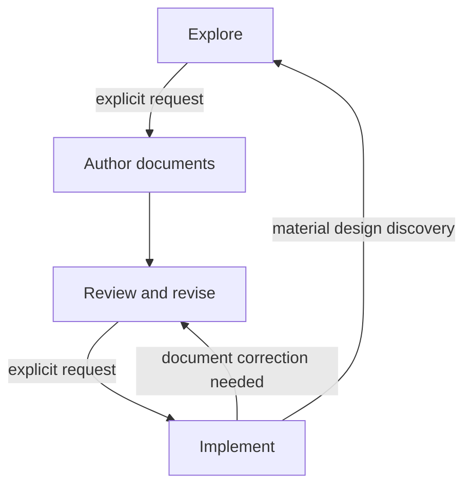

## 📗 Problem Statement

> [!NOTE] Prompt
>  
> I want transform my EXPLORE/SPEC/PLAN/IMPLEMENT prompts into elaborate Specification-Driven Development (sdd-man) skill. I want to start with the attached context:
> 
> - `Skill Template EXPLORE_DRIVE.md` - multiturn conversational exploratory developing skill development strategy
> - `Skill Template SPEC.md` - template skill specification, which should be used as a reference to be adapted
> 
> EXPLORE/SPEC/PLAN/IMPLEMENT prompts to be transformed into skill
> 
> - `SPI - EXPLORE.md`- multiturn conversational exploratory developing SPEC/PLAN/IMPLEMENT prompts
> - `implementation-and-recovery-protocol-prompt.md` - implementation prompt
> - `spec-plan-strategy-prompt.md` - SPEC and PLAN prompt
> - `specification-driven-development-preamble.md` governs the exploration preceding SPEC/PLAN generation.
> 
> As I see it now, the current prompts shall define the following workflows:
> 
> - Exploration
> - Layout generation
> - Specification generation
> - Plan generation
> - Greenfield resumable implementation
> - Brownfield/incremental/feature resumable implementation 
> - "Checkpoints" in git and non-git projects
> - Determination/discovery of git vs non-git projects
> - Testing strategy
> - Bug/failed tests fixing
> - Discovering current project status at startup
> - Resumption protocol
> - Journaling protocol establishing recovery from partially implemented feature due to agent interruption
> 
> What else (based on what current prompts define)? I will add new features after we have preliminary structure for the current scope.

Your list captures the main visible operations, but the current prompts define a broader lifecycle. Several important capabilities are also hidden inside what presently looks like “implementation” or “resumption.”

I would organize the preliminary scope into workflows, shared protocols, and system-wide invariants rather than treating every concern as an independent workflow.

### 1. Primary workflows

#### A. Exploration and decision formation

Already identified as **Exploration**, but the prompts define more than open-ended discussion:

* problem framing and vocabulary normalization;
* goals, scope, constraints, and non-goals;
* alternatives and tradeoff analysis;
* architecture, contract, data-model, and tooling exploration;
* separation of facts, user decisions, assumptions, unresolved questions, and rejected alternatives;
* contradiction and weak-boundary detection;
* compact decision-state summaries;
* explicit readiness assessment for specification;
* exploratory prototype classification:
    * disposable experiment outside the project;
    * actual project change governed by implementation protocol.

This is also responsible for preventing tentative ideas from becoming requirements accidentally.

#### B. Development-document authoring

This is better treated as one orchestrated workflow with three branches:

1. **LAYOUT generation or restructuring**
2. **SPEC generation or restructuring**
3. **PLAN generation or restructuring**

The branches share preliminary work:

* inspect an existing project when applicable;
* consolidate accepted exploration decisions;
* identify unresolved design blockers;
* determine the appropriate document-tree decomposition;
* assign every normative subject one canonical owner;
* generate complete-current-state documents rather than conversation summaries.

The documents need not be generated in a rigid order. For a greenfield project, a likely sequence is:

```text
accepted design
    ↓
high-level architecture and physical layout
    ↓
SPEC tree
    ↓
PLAN tree
    ↓
cross-tree consistency review
```

But SPEC design may reveal a better LAYOUT boundary, and planning may expose a missing specification contract. The workflow therefore needs controlled iteration rather than a strictly linear pipeline.

#### C. Review and revision

This is a distinct workflow missing from your list.

The preamble explicitly establishes a mode between document generation and implementation. It includes:

* reviewing generated SPEC, PLAN, and LAYOUT documents;
* applying user corrections as design changes rather than cosmetic edits;
* propagating changes through affected parent and child nodes;
* removing superseded content;
* rechecking architecture, dependency direction, testability, and task order;
* detecting contradictions among SPEC, PLAN, LAYOUT, and shared documents;
* remaining in review mode until implementation is explicitly requested.

This workflow should also support reviewing an existing document set without regenerating it.

#### D. Greenfield implementation campaign

Already identified. It includes:

* selecting the main SPEC and PLAN trees;
* constructing the system in dependency-ordered functionality phases;
* producing the smallest useful testable MVP first;
* executing one bounded PLAN task at a time;
* updating code, tests, and documentation together;
* phase closure;
* final campaign acceptance and completion.

#### E. Feature or revision campaign

Your brownfield workflow should explicitly cover both small features and architectural revisions:

* establish the main documentation and codebase as the baseline;
* use temporary `FEATURE-SPEC.md` and `FEATURE-PLAN.md` as the intended delta;
* determine precisely where feature documents override the baseline;
* support expand–migrate–contract changes;
* revise affected components in dependency order;
* maintain valid intermediate states;
* integrate settled requirements back into the authoritative trees;
* remove temporary feature documents at campaign completion.

This is materially different from merely “implementing in an existing repository.”

#### F. Existing campaign continuation

This deserves explicit recognition separate from ordinary recovery.

The protocol distinguishes:

* starting an initial campaign;
* starting a feature campaign;
* continuing a previously declared campaign.

When a campaign record already exists, it determines:

* campaign mode;
* active specification and plan;
* baseline document set;
* latest task;
* whether starting a different campaign is permitted.

Thus, “resume implementation” first resumes the campaign identity, then resolves the current transaction.

#### G. Document-only architectural evolution

The prompts allow design work without authorizing code modification. This workflow covers:

* splitting or merging SPEC nodes;
* reorganizing PLAN phases;
* decomposing or consolidating LAYOUT nodes;
* changing canonical ownership;
* correcting dependency direction;
* integrating feature design into authoritative documents before implementation.

It overlaps review and revision, but is useful as an explicit invocation because users may ask to restructure project documentation without starting an implementation campaign.

### 2. Discovery and assessment workflows

#### H. Project and authority discovery

This is broader than Git detection:

* locate the project root;
* locate `docs/dev/SPEC.md`, `PLAN.md`, LAYOUT, PROJECT, and feature documents;
* discover repository-root and directory-scoped `AGENTS.md`;
* follow referenced instruction files;
* determine which instructions apply to each anticipated target;
* detect missing, unreadable, contradictory, or ambiguous authorities;
* establish precedence among:
    * user request;
    * active feature documents;
    * authoritative main documents;
    * project instructions;
    * implementation protocol.

This should produce a compact **project authority map**.

#### I. Repository-capability discovery

This includes your Git/non-Git determination, but should also establish:

* repository root and current `HEAD`;
* tracked, staged, and untracked state;
* dirty target paths versus unrelated dirty paths;
* available build, test, lint, type-check, and packaging commands;
* generated-file and ignored-file policies;
* whether task commits are available;
* whether local exclusion of recovery data is possible;
* filesystem capabilities needed to preserve file type, executable state, and symlinks.

#### J. Project-state diagnosis

“Discover current project status at startup” should produce an explicit status classification:

* exploration only;
* specified but not planned;
* planned but not implemented;
* initial campaign not started;
* feature campaign not started;
* active task started but not prepared;
* active task prepared but incomplete;
* completed but uncommitted task;
* committed but not cleaned task;
* between tasks;
* phase complete;
* campaign complete;
* inconsistent or ambiguous state.

This diagnostic workflow should be usable independently—for example, “Tell me where this project stands”—without authorizing recovery or implementation.

#### K. Documentation/code conformance assessment

The completion standard implies a separate audit capability:

* compare documented behavior with implementation;
* compare PLAN tasks with actual implementation state;
* compare LAYOUT ownership with physical files;
* map tests to specified behavior and acceptance conditions;
* identify stale, missing, duplicated, or contradictory normative content;
* distinguish documentation drift from implementation defects;
* recommend whether the next action is exploration, document revision, implementation, or recovery.

### 3. Transactional implementation protocols

#### L. Task selection and preflight

This is more specific than implementation itself:

* identify the next incomplete task in declared order;
* load only relevant SPEC, PLAN, LAYOUT, feature, and instruction nodes;
* inspect affected code and tests read-only;
* bound the task;
* enumerate anticipated paths;
* classify operations as `create`, `modify`, `delete`, or `rename`;
* determine targeted, dependent, integration, and broader verification;
* detect collisions with pre-existing changes;
* create a stable task identifier.

#### M. Task preparation and baseline capture

A separate low-level protocol:

* append `STARTED`;
* calculate the baseline fingerprint;
* create the transaction directory;
* create and verify the manifest;
* back up existing targets;
* preserve bytes, file type, executable state, symlinks, and rename endpoints;
* append `PREPARED`;
* prohibit modification until preparation is durable.

#### N. Controlled scope extension

This is an explicit workflow in the recovery protocol and should not be hidden inside implementation:

* stop before modifying the newly discovered path;
* discover newly applicable instructions;
* journal the proposed extension;
* capture its baseline;
* version and re-hash the manifest;
* append another prepared record;
* resume only after the new scope is recoverable.

#### O. Task completion and durable closure

This covers more than checkpoints:

* inspect the resulting file scope;
* verify document/code/test consistency;
* execute the ordered verification ladder;
* append the completion record;
* stage only declared paths;
* create and verify the task commit when Git is available;
* retain recovery state if committing fails;
* remove backups only after durable completion;
* verify no task residue remains.

Git commits are therefore one form of durable task closure, not the entire checkpoint mechanism.

#### P. Controlled stop and rollback

The prompts define a controlled interruption path in addition to crash recovery:

* when verification cannot be completed;
* when implementation discovers a material design defect;
* when task scope becomes substantially larger;
* when a governing instruction is contradictory;
* when undeclared changes are discovered.

The default controlled stop restores the complete task baseline and journals `REVERTED`, unless the user explicitly directs retention of the prepared state.

#### Q. Evidence-preserving escalation

A recurring but important protocol:

* do not guess when the journal, manifest, filesystem, backups, or Git disagree;
* preserve recovery data;
* avoid destructive cleanup;
* report the exact inconsistency;
* request user direction when origin or ownership of changes is uncertain.

This is distinct from ordinary failure handling.

### 4. Verification and repair workflows

#### R. Verification-strategy derivation

Your “Testing strategy” should include:

* deriving tests from SPEC behavior and boundary conditions;
* associating unit tests with implementation files or components;
* identifying dependent-component tests;
* defining integration tests;
* selecting lint, type-check, build, packaging, and formatting checks;
* defining phase-level and campaign-level verification;
* distinguishing required checks from useful optional checks;
* ensuring every PLAN task has objective completion conditions.

#### S. In-task failure repair

“Bug/failed tests fixing” needs at least two modes:

1. **Task-caused failure**
    * repair within the current transaction;
    * keep the fix within declared behavior and scope;
    * extend scope safely when additional files are necessary;
    * repeat affected verification.
2. **Unrelated or pre-existing failure**
    * do not silently absorb it into the task;
    * establish whether it blocks required verification;
    * report it or create a later PLAN task;
    * avoid weakening tests merely to obtain a passing run.

#### T. Standalone defect campaign

A user may request a bug fix without existing feature documents. The skill needs to decide whether the defect:

* is already covered by the current SPEC and represents an implementation nonconformance;
* reveals an underspecified boundary;
* changes intended behavior and therefore requires feature specification;
* can be handled as a bounded corrective task;
* needs a temporary feature campaign.

That classification is currently implied but not named.

#### U. Acceptance and conformance verification

At phase or campaign completion:

* run declared acceptance scenarios;
* verify system-level acceptance conditions;
* verify SPEC, PLAN, LAYOUT, tests, and implementation agree;
* confirm temporary feature materials have been integrated and removed;
* confirm recovery state is clean;
* confirm every completed task has durable evidence.

### 5. Development-document management protocols

#### V. Recursive document decomposition

This applies independently to SPEC, PLAN, LAYOUT, and other shared documents:

* retain a focused node as one file;
* split only at meaningful responsibility or contract boundaries;
* turn the former document into an orienting parent;
* define child scope and relationships;
* keep roots useful rather than link-only;
* avoid arbitrary fragmentation and ordinal filenames;
* keep resources shallow enough for efficient context loading.

#### W. Canonical ownership and deduplication

The prompts strongly require:

* one canonical location per normative subject;
* links instead of duplicated normative prose;
* parent nodes defining relationships and boundaries;
* child nodes adding detail without broadening their assigned scope;
* removal of obsolete and superseded requirements;
* no use of miscellaneous shared documents as overflow containers.

#### X. Cross-tree traceability

Not requirement-ID traceability, but architectural routing:

* SPEC responsibility → implementation location;
* implementation location → test ownership;
* SPEC node → PLAN phase or phases;
* PLAN task → relevant SPEC contracts;
* physical area → governing LAYOUT node;
* feature delta → affected authoritative nodes.

The skill should preserve this without introducing artificial identifiers such as `STREAM-001`.

#### Y. LAYOUT refactoring

This is more than initial layout generation:

* inventory all physical-organization requirements;
* assign every item a destination;
* split by ownership domain rather than document size;
* keep docs, source, and tests separate when independently substantial;
* preserve packaging, generated-artifact, and runtime policies;
* repair cross-references;
* verify routine tasks require only a small focused context set.

#### Z. Temporary feature-document lifecycle

A complete workflow:

```text
create feature delta
→ review
→ implement against baseline + delta
→ correct approved discoveries
→ integrate final state into main trees
→ remove superseded content
→ delete temporary feature documents
```

Feature documents are not permanent historical records.

### 6. Architectural reasoning protocols

#### AA. Dependency analysis

The strategy defines:

* dependency graph construction;
* `A → B` meaning “B depends on A”;
* cycle detection;
* merging mutually dependent components or extracting a lower-level contract;
* identifying dependency-ordered implementation paths;
* allowing reconvergent and diamond dependencies.

#### AB. Incremental contract migration

For incompatible changes:

```text
expand
→ migrate dependents in dependency order
→ contract
```

Every intermediate task must remain internally consistent and testable.

#### AC. Design-discovery feedback

Implementation can uncover a missing or incorrect design decision. The workflow must:

* distinguish delegated implementation detail from architectural change;
* stop at a safe task boundary;
* return to exploration or specification revision;
* update authoritative documents;
* resume implementation only after the design is settled.

This prevents silent divergence from the specification.

### 7. Conversation and authorization protocols

#### AD. Mode and transition management

This is one of the most important missing items.

The skill must recognize and enforce:



In particular:

* exploration does not authorize document creation;
* document creation does not authorize implementation;
* a technical question does not imply a mode transition;
* an explicit implementation request may enter implementation directly if adequate documents already exist;
* ambiguous requests that would modify authoritative files require clarification.

#### AE. Truthful status and completion reporting

The preamble requires accurate labels such as:

* explored;
* specified;
* planned;
* under revision;
* partially implemented;
* blocked;
* reverted;
* completed.

The skill must never report a proposed design as implemented, a prepared task as completed, or unverified code as successful.

#### AF. Continuity and decision discipline

Across multiple turns:

* preserve settled terminology;
* avoid reopening decisions without new evidence;
* surface conflicts with earlier decisions;
* distinguish accepted and tentative conclusions;
* consolidate scattered conclusions before authoring documents;
* ensure the project remains understandable without conversation history.

### Recommended preliminary skill model

I would not expose all of these as equal top-level workflows. A cleaner orchestration model is:

| Top-level route      | Principal subworkflows                                               |
| -------------------- | -------------------------------------------------------------------- |
| **Explore**          | problem framing, alternatives, decision state, readiness             |
| **Inspect**          | project discovery, authority map, state diagnosis, conformance audit |
| **Design documents** | LAYOUT, SPEC, PLAN, feature documents                                |
| **Review documents** | consistency, propagation, decomposition, correction                  |
| **Implement**        | initial, feature, defect, or continuation campaign                   |
| **Recover**          | startup inspection, rollback, completed-task reconciliation          |
| **Verify**           | task, phase, campaign, acceptance, conformance                       |
| **Report status**    | current mode, campaign, phase, task, blockers, next action           |

Shared protocols would support those routes:

* authority and precedence;
* document ownership and decomposition;
* dependency ordering;
* transactional task execution;
* journaling and manifests;
* Git/non-Git durable completion;
* testing and failure classification;
* escalation and controlled stopping.

### Likely skill-package structure

Following the progressive-disclosure pattern demonstrated by the attached skill template, `SKILL.md` should primarily route work rather than contain the entire SDD manual:

```text
sdd-man/
├── SKILL.md
├── references/
│   ├── lifecycle-and-transitions.md
│   ├── exploration.md
│   ├── project-discovery.md
│   ├── document-architecture.md
│   ├── layout-workflow.md
│   ├── specification-workflow.md
│   ├── planning-workflow.md
│   ├── review-and-revision.md
│   ├── campaign-selection.md
│   ├── task-transaction.md
│   ├── recovery.md
│   ├── verification-and-repair.md
│   └── completion-and-integration.md
├── scripts/
│   ├── inspect_status.py
│   ├── prepare_task.py
│   ├── verify_transaction.py
│   └── recover_task.py
└── assets/
    ├── document-templates/
    └── journal-schemas/
```

The exact scripts should be decided later. However, deterministic handling of journals, manifests, hashes, backup verification, and status diagnosis is an especially strong candidate for executable helpers. Architectural judgment, exploration, and document decomposition should remain reference-guided agent workflows.

The most consequential additions to your original list are therefore:

* explicit mode and authorization transitions;
* review and revision;
* project-authority discovery;
* campaign selection and campaign identity;
* document/code conformance auditing;
* temporary feature-document lifecycle;
* task preflight and baseline preparation;
* controlled scope extension;
* controlled stop and rollback;
* evidence-preserving escalation;
* phase and campaign closure;
* dependency analysis and contract migration;
* cross-tree traceability and canonical ownership;
* truthful status reporting;
* design-discovery feedback from implementation.

---
---

## 📗 Problem Refinement

> [!NOTE] Prompt
>  

Good. Now, I have been thinking about several things. The first one was suggested by the following turn occurred after partial implementation:

```
> [!NOTE] Prompt
> 
> How may phases/milestones are/can be defined for the rest of the process?

There are **3 remaining top-level phases**, containing **25 implementation tasks**. The current phase structure is already coherent and does not need further top-level splitting.

| Remaining phase     |  Tasks | Suggested milestones |
| ------------------- | -----: | -------------------: |
| Archive streams     |     11 |                    5 |
| Index persistence   |      7 |                    4 |
| Package integration |      7 |                    3 |
| **Total**           | **25** |               **12** |

#### Recommended milestone structure

##### Phase 2: Archive streams

1. **Archive test foundation**
    * Shared generated archive fixtures and failure cases.
2. **ZIP support**
    * ZIP streaming backend.
    * Registry/public API integration.
    * ZIP stream and index verification.
3. **TAR support**
    * Seekable TAR handling.
    * Non-seekable streaming TAR completion.
    * Registry/public API integration.
    * TAR, TGZ, TBZ, and related filter verification.
4. **7z support**
    * Bounded queue protocol.
    * `py7zr` extraction destination.
    * Inspection and public error translation.
    * Registry/public API integration.
5. **Archive lifecycle certification**
    * Cross-format cleanup, early close, failure, ownership, integrity, and thread-lifecycle tests.
    * Full archive-phase verification.

##### Phase 3: Index persistence

6. **Persistence validation foundation**
    * Finalize offset validation shared by both formats.
7. **SQLite persistence**
    * Atomic writing.
    * Strict reading and validation.
    * Existing-destination protection.
8. **Raw `uint64` persistence**
    * Headerless little-endian writing.
    * Strict reading, alignment checks, and validation.
    * Atomic publication.
9. **Persistence API integration**
    * Public exports.
    * SQLite/raw equivalence.
    * Persistence of indexes produced from every supported source format.
    * Full persistence-phase verification.

##### Phase 4: Package integration

10. **Distribution surface**
     * Final exports.
     * `py7zr` dependency constraints.
     * Build metadata.
     * User README and examples.
11. **Operational hardening**
     * Large-input and backpressure verification.
     * Cross-platform filesystem and cleanup behavior.
12. **Release acceptance**
     * Wheel and source-distribution builds.
     * Clean installed-package workflows.
     * Plain, ZIP, TAR, 7z, SQLite, and raw end-to-end tests.
     * Documentation reconciliation and complete SPEC acceptance review.

So the useful hierarchy is:

* **3 phases** — major architectural capabilities.
* **12 milestones** — meaningful stopping/review points.
* **25 task transactions** — the individually backed-up, tested, logged units required by the implementation protocol.

The next natural stopping point would be **Milestone 2: ZIP support**, rather than waiting for the entire archive phase.
```

Recommended milestone structure is essentially a roadmap which must be exactly aligned with implementation plan. Further, this items of this road map can be transformed into checked list. The coding agent will have to check a completed task before or after adding a completion record to the journal. At start, coding agent will use it as a second (or first) source of project status, confirming 