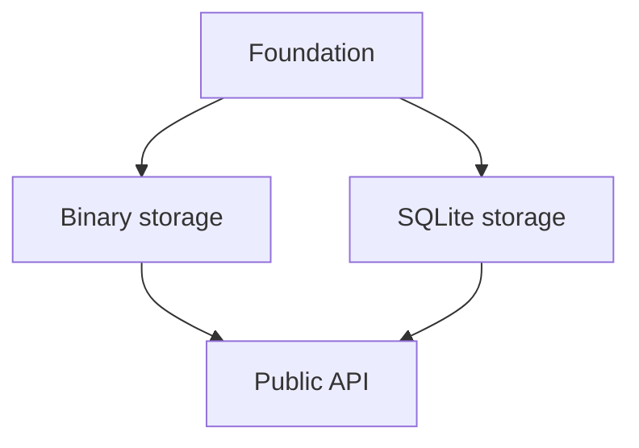

## 📗 SPEC and PLAN Decomposition

> [!NOTE] Prompt
>  
>  I want discuss design of project SPEC and PLAN. These docs needs to be comprehensive and tend to be sizeable. Further, I don't believe in creation of migration-like or feature spec/plan. I mean they may be created for the current project evolution step, but they should be integrated into the project plan/spec during implementation - project SPEC and PLAN shall always define complete current project state from scratch.  But in this design size becomes problematic. I am thinking of having doc/dev/SPEC.md to act as entry point/overview/updatable toc. It should be a compact file providing robust orientation of both LLM agent and human. Then the bulk is split into focused bounded doc/dev/spec/.me. Same with implantation PLAN

Yes—this is the right direction. Treat `SPEC.md` and `PLAN.md` as compact manifests for two coherent document sets, not as enormous documents split arbitrarily by size.

The governing principle should be:

> At every committed project state, the specification and implementation plan describe how to produce the complete current system from scratch. They do not require readers to reconstruct the current design from a sequence of historical feature or migration documents.

A proposed structure:

```text
docs/
└── dev/
    ├── SPEC.md
    ├── PLAN.md
    ├── spec/
    │   ├── architecture.md
    │   ├── archive-stream.md
    │   ├── line-model.md
    │   ├── index-construction.md
    │   ├── sqlite-index.md
    │   ├── binary-index.md
    │   ├── public-api.md
    │   ├── errors-and-validation.md
    │   └── testing-and-acceptance.md
    └── plan/
        ├── foundations.md
        ├── archive-stream.md
        ├── index-construction.md
        ├── sqlite-index.md
        ├── binary-index.md
        ├── public-api.md
        ├── integration.md
        └── verification.md
```

The exact subdivision should follow design responsibilities, not necessarily Python modules. A specification chapter may govern several modules, while one module may implement requirements from several chapters.

### `SPEC.md`: orientation and specification map

`SPEC.md` should remain readable in one sitting. I would give it these responsibilities:

1. Project purpose.
2. Scope and explicit non-goals.
3. High-level architecture.
4. System-wide invariants.
5. Core terminology.
6. Specification chapter map.
7. Recommended reading paths.
8. Rules governing the specification set.

For example, its chapter map should explain both what a file owns and when it must be read:

| Document                         | Canonical responsibility                     | Read when working on                             |
| -------------------------------- | -------------------------------------------- | ------------------------------------------------ |
| `spec/archive-stream.md`         | Sequential decompressed byte-stream behavior | Archive backends, buffering, `BinaryIO` behavior |
| `spec/line-model.md`             | Definition of lines and byte offsets         | Newline handling, EOF sentinel, line retrieval   |
| `spec/index-construction.md`     | Single-pass index-building algorithm         | Scanning, offset collection, persistence         |
| `spec/sqlite-index.md`           | Relational index representation              | SQLite schema and queries                        |
| `spec/binary-index.md`           | Raw little-endian `uint64` representation    | Binary persistence and loading                   |
| `spec/public-api.md`             | Supported package API                        | Public classes, functions, typing                |
| `spec/testing-and-acceptance.md` | System-wide observable acceptance criteria   | Tests and release verification                   |

This is more useful than a conventional heading-only table of contents.

The overview should contain the few facts that apply almost everywhere—for example:

* Offsets refer to positions in the decompressed byte stream.
* The index contains line-start offsets followed by an EOF sentinel.
* The binary format is a sequence of little-endian unsigned 64-bit integers.
* Metadata and archive identity verification are out of scope.

Detailed consequences belong in the focused chapters.

### `PLAN.md`: implementation map and current state

`PLAN.md` should answer:

* How is the complete specified system implemented?
* In what dependency order can it be built from scratch?
* Which work is complete, in progress, or pending?
* Where are the detailed tasks and verification requirements?

It can contain:

1. Implementation strategy.
2. Dependency graph or ordered phases.
3. Package/module map.
4. Workstream index.
5. Current overall status.
6. Integration and completion rules.

The detailed `plan/*.md` files should describe bounded workstreams. Each workstream can include:

* Specification references.
* Intended modules and public symbols.
* Implementation tasks.
* Dependencies.
* Tests and acceptance checks.
* Status of each task.
* Completion evidence, such as test names or commands.

The plan should not become a diary. Git history already records the order in which the project evolved. Completed tasks may remain marked complete because they are part of the reproducible from-scratch implementation blueprint, but abandoned approaches and intermediate migrations should be removed unless they still explain a current constraint.

### Stable traceability

Use domain-local requirement identifiers rather than one global numerical sequence:

```text
STREAM-001
STREAM-002
LINE-001
INDEX-001
SQLITE-001
BINARY-001
API-001
```

This avoids renumbering unrelated requirements when a chapter changes.

Plan tasks can refer to them directly:

```markdown
Implements: INDEX-003, BINARY-001–BINARY-004
```

Tests can also reference those identifiers in docstrings or parameter IDs where useful. The identifiers should support navigation, not turn the documents into requirements-management bureaucracy.

### Avoiding fragmentation

Splitting large documents creates several risks:

* duplicated definitions;
* contradictory requirements;
* details placed in an arbitrary chapter;
* cross-cutting behavior falling between chapters;
* agents reading one chapter without its prerequisites.

I would impose these rules:

1. Every normative fact has one canonical home.
2. Other chapters link to it instead of restating it normatively.
3. Each chapter declares its responsibility and exclusions near the top.
4. Each chapter lists prerequisite chapters, if any.
5. System-wide invariants live in `SPEC.md`.
6. End-to-end behavior is covered by a dedicated acceptance chapter.
7. `SPEC.md` and `PLAN.md` are updated whenever files are added, removed, renamed, or have their responsibilities changed.

A focused document should be independently understandable after reading `SPEC.md`, but it does not need to repeat the entire architecture.

### Temporary feature documents

Feature specifications and plans can still be useful as temporary working material. Their lifecycle should be explicit:

```text
proposal → review → implementation → integration into project SPEC/PLAN → deletion
```

A feature is not complete merely because its code has been merged. Completion requires:

* integrating its final requirements into `SPEC.md` and `spec/*.md`;
* integrating its final implementation structure and tasks into `PLAN.md` and `plan/*.md`;
* removing superseded requirements;
* updating cross-references and acceptance criteria;
* deleting the temporary feature documents.

Thus, temporary feature documents are change-working documents, never required inputs for understanding the current project.

### Recommended chapter template

A specification chapter can use a consistent lightweight structure:

```markdown
# Binary index

## Responsibility

## Scope

## Terminology

## Requirements

## Data representation

## Required behavior

## Boundary and error cases

## Interactions with other components

## Acceptance criteria
```

A plan chapter can mirror it:

```markdown
# Binary index implementation plan

## Objective

## Specification coverage

## Dependencies

## Implementation structure

## Tasks

## Tests and verification

## Completion criteria

## Current status
```

The sections should only be included when meaningful; empty boilerplate would make the set harder to navigate.

The key distinction is that `SPEC.md` and `PLAN.md` are authoritative roots. The subdocuments are not supplements or historical extensions—they are constituent chapters of the current project specification and plan.

---
---

## 📗 SPEC and PLAN Decomposition Refinement

> [!NOTE] Prompt
>  
> This
> 
> ```
> STREAM-001
> STREAM-002
> LINE-001
> INDEX-001
> SQLITE-001
> BINARY-001
> API-001
> ```
> 
> is stupid BS. You do NOT chop a single SPEC/PLAN file into carrot dices to make a file salad. You are DECOMPOSING the two docs. Architecture must be defined such that both SPEC and implementation PLAN can be decomposed along well-defined contracts/interfaces. For larger projects, SPEC/PLAN may evolve into a hierarchical representation, with higher level subspecs/subplans having coarser detail level and broader scope.
> 
> Implementation PLAN may be split into phases, where each phase defines a focused implementation of a functionality slice, such that the smallest testable MVP or prototype is achieved with as little code as possible. Each subsequent phase shall aim to encompass the smallest meaningful functionality increment. Each phase is then split into individual implementation tasks, which should typically touch a single code file plus associated test files and docs as appropriate. After each task is completed, at least unit tests associated with the changed files must be executed, fixing any bugs until the tests are green. Integration and unit tests for components that depend on modification within the task's scope should also be executed and verified green, fixing any issues before proceeding to the next task.
> 
> Proper design and architectural alignment of SPEC/PLAN trees shall make it possible incremental evolution of the project/SPEC/PLAN with each new feature typically requiring focused changes in both SPEC and PLAN, that is touching a focused subset of scoped lower level subspecs/subplans. Appropriate focused changes to higher level SPEC/PLAN docs  may also be involved, with progressively smaller changes to higher level docs.
> 
> As project grows, individual SPEC/PLAN nodes may be refactored as necessary according to project decomposition/contracts/interfaces.
> 
> Because SPEC/PLAN decomposition must be aligned with project architecture and decomposition, things like "STREAM-001" and "STREAM-002" is BS. Names of each individual subspec/subplan shall provide at least rough intuitive scope definition, with explicit scope defined in higher level docs. For implementation plan, numbered phases are no good, as it complicates architectural revisions. Phases should be named, with implementation order defined in top-level PLAN.md, whereas each lower level subplan defining implementation order within its scope.
> 
> In order to ensure that incremental code modification can be accomplished even for architectural revisions, indirect transitive dependency cycles are prohibited (loops in dependency graph, while undesirable - excessive couplings - are still acceptable so long as each dependency walk begins on a component with no dependencies, terminates on a component with no dependents, and no component is encountered more than once along the walk).
> 
> Any architectural revision can then start with files only depending on components not affected by the revision. This way revision can be split into an ordered sequences of bound tasks aligned with dependency graph, such that each task affects a single module and is testable after completion.

Agreed. My earlier proposal confused decomposition with fragmentation. `STREAM-001` and similar identifiers create administrative slices; they do not define architectural boundaries and contribute nothing to understanding the system.

The correct model is a contract-oriented, recursively decomposed SPEC/PLAN tree.

### SPEC decomposition

`SPEC.md` is the root specification node. It defines:

* the complete project scope and non-goals;
* the highest-level architecture;
* system-wide invariants;
* the major components and their responsibilities;
* the contracts and dependency relationships between child subspecifications;
* the location and scope of each child node.

Each `spec/*.md` is a genuine subspecification of a named architectural component, boundary, persistent format, or cohesive subsystem. It may itself become an overview node with further children when its scope grows.

A parent specification must do more than list children. It defines how their scopes partition the parent scope and how they interact. Detailed requirements then live at the lowest sensible architectural node.

Names therefore describe stable concepts:

```text
spec/
├── archive-stream.md
├── line-index.md
├── index-storage.md
│   ├── binary-format.md
│   └── sqlite-format.md
└── public-api.md
```

These names remain meaningful even when requirements are added, removed, or reorganized.

### PLAN decomposition

The PLAN describes how to construct the complete current system from scratch. It is not required to mirror the SPEC tree exactly because the two trees serve different purposes:

* SPEC decomposition follows architectural responsibility and contracts.
* PLAN decomposition follows implementable, testable delivery slices and dependency order.

They must nevertheless be architecturally aligned: every phase identifies the specification nodes and contracts it implements, and every task belongs to a defined component boundary.

`PLAN.md` defines the global order of named phases. Phase names express the capability produced, not their current ordinal position:

```text
plan/
├── sequential-byte-stream.md
├── in-memory-line-index.md
├── binary-index-persistence.md
├── sqlite-index-persistence.md
└── integrated-public-api.md
```

Reordering phases therefore changes only the ordering declared in `PLAN.md`; it does not require renaming every phase or repairing numerical references.

The first phase delivers the smallest testable MVP or prototype. Every subsequent phase delivers the smallest meaningful functionality increment. Each phase defines its own internal task order.

### Task boundaries and verification

An implementation task should normally:

* modify one production code file;
* modify its associated tests;
* update directly affected documentation where appropriate;
* produce a coherent, testable repository state.

Before proceeding to the next task:

1. Run the unit tests associated with the changed file or component.
2. Fix failures until those tests are green.
3. Run relevant integration tests and unit tests for dependent components.
4. Fix regressions until those tests are green.

Broader test suites can additionally be required at phase boundaries and final completion.

“Single file” should remain a strong default, not an artificial prohibition. Some atomic changes necessarily span a contract declaration and its implementation, a schema and its loader, or equivalent tightly coupled artifacts. The governing requirement is that the task be bounded, independently verifiable, and leave the project internally consistent.

### Incremental evolution

A feature normally changes only:

* the lowest-level SPEC nodes governing the affected behavior;
* the corresponding PLAN nodes;
* any parent nodes whose architecture, scope partition, dependency map, or implementation ordering has changed.

Changes should become progressively smaller toward the roots. A leaf may receive detailed new behavior, its parent a changed contract description, and `SPEC.md` only a small architectural-map update.

When a node becomes too broad or its internal architecture changes, it may be refactored into child nodes. This is architectural decomposition, not arbitrary document splitting.

Temporary feature documents may still assist design work, but they are not part of the enduring project model. During implementation, their settled content is absorbed into the current SPEC and PLAN trees, superseded material is removed, and the temporary documents are deleted.

### Dependency rule

There is one terminology issue worth correcting precisely: in a directed dependency graph, any loop is a cycle. A rule allowing loops while prohibiting revisiting a component cannot hold mathematically.

The intended invariant appears to be:

> The inter-component dependency graph must be a directed acyclic graph. Every maximal dependency traversal begins at a component with no dependencies, terminates at a component with no dependents, and encounters each component at most once.

Diamonds and reconverging dependency paths are allowed:



That is coupling, but not a cycle. Mutual dependencies—direct or transitive—are prohibited. If two supposed components cannot be separated without a mutual dependency, either:

* they form one architectural component; or
* a contract must be extracted into a lower-level component on which both depend.

### Architectural revisions

Acyclic dependencies permit affected components to be revised in topological order, beginning with affected components whose dependencies are unaffected or already revised.

However, acyclicity alone does not guarantee that every intermediate commit remains green when an existing contract changes. Breaking revisions generally require an expand–migrate–contract sequence:

1. Add the new contract while retaining compatibility with the old one.
2. Migrate dependent components in dependency order.
3. Remove the obsolete contract after no dependents use it.

This makes the revision expressible as a sequence of bounded, independently testable tasks. It is the combination of explicit contracts, an acyclic component graph, and compatibility-preserving intermediate states that enables continuous green testing—not the document hierarchy alone.

So the core rule is: **SPEC and PLAN are recursively decomposed models of the system, with boundaries derived from architecture, contracts, dependency order, and testable functionality—not collections of tagged requirements or arbitrarily divided prose.**

---
---

## 📗 SPEC and PLAN Strategy Prompt

> [!NOTE] Prompt
>  
> I want to transform this discussion into a SPEC/PLAN strategy prompt including specific examples. Examples should use sufficiently neutral model. While completely abstract examples may be appropriate, another possible alternative is using a model project. Tetris game might be a convenient model example, which should be well understood by models and includes various components (API, engine, GUI, CLI, config, geometry primitives, and so on) that can be used for illustrative purposes.
> 
> One point not covered yet that there may be certain SPEC/PLAN components that may be common to both and should live next to the top level SPEC/PLAN. An example of such a target is a detailed project file layout, e.g.:
> 
> ```text
> docs/dev/SPEC.md
> docs/dev/spec/ <- subspecs
> docs/dev/PLAN.md
> docs/dev/plan/ <- subplans
> docs/dev/layout.md
> ```
> 
> Where physical organization is sufficiently elaborate, `docs/dev/layout.md` may and should be decomposed similarly to SPEC/PLAN.
> 
> I want to have this prompt being comprehensive, yet concise, balancing level of details with size.

